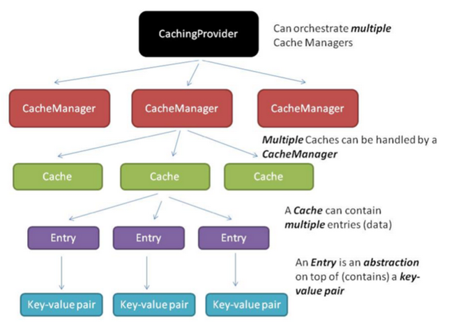
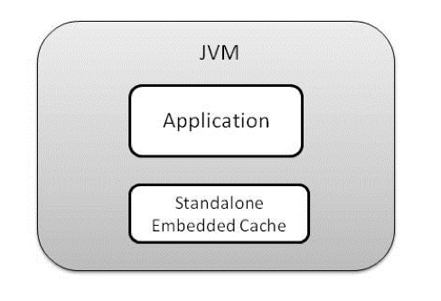
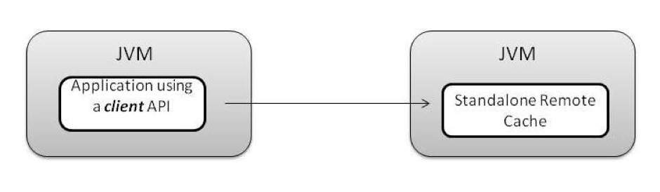
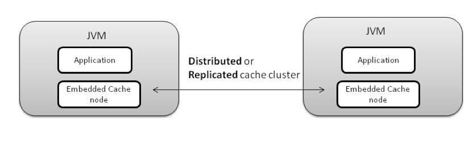
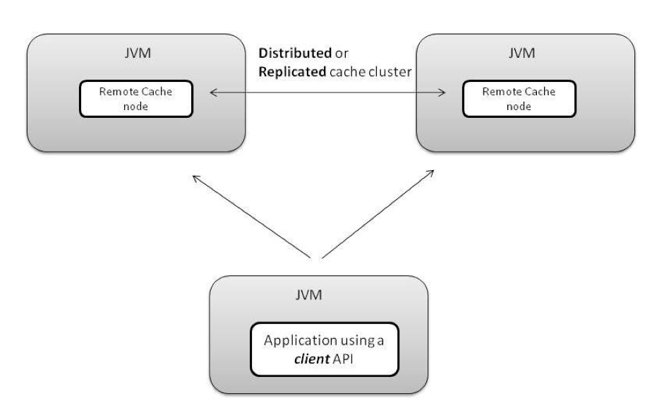

## 常见Cache

常见的 Java Cache 生态：

- Ehcache
- Hazelcast
- Infinispan
- GridGain
- Apache Ignite

## JCache Arc



### 5个核心接口

Cache提供了五个核心接口：

- ``CachingProvider``: 定义了创建、配置、获取以及控制一个或多个CacheManager的方法。程序在运行过程中可以使用一个或多个CacheProvider。

- ``CacheManager``: 定义了创建、配置、获取以及控制一个或多个Cache。一个CacheManager从属于一个CachingProvider。

- ``Cache<K, V>``: 类似Map的数据结构，用来暂存数据。一个Cache从属于一个CacheManager。

- ``Entry<K, V>``: key-value结构的单一元素，存储在Cache里。
-
- ``ExpiryPolicy``: 一个存储在Cache中的Entry，都有存储的规则，像：会不会过期？怎么过期？这些规则统称为ExpirePolicy。

### 2种存储方式

存储方式有两种：

- 按value存（默认）：当一个对象要被存到Cache里时，会拷贝后再放到Cache，读取Cache时返回的也是拷贝后的值。

- 按``Reference``存：当一个对象要被存放到Cache里时，就直接
按key存放了相应的值，并不会进行拷贝。这样的后果是当程序里的值改变后，相应存放在Cache里的值也会改变（不需要调用 ``cache.put()``）。

### 并发访问与一致性

Cache一致性是指当多个进程同时访问或操作同一个Cache时应该有的规则。

所有的实现类都应该遵循JCache的默认规则（如下）：

- 悲观锁机制

>即Cache在操作时考虑在key上加锁。即读取Cache时，这时候就需要写一个``lock``方法 **锁住该key**，在这个时候其它所有的操作都会被阻塞直到该锁被释放。加锁行为应该是在读操作的之前，或是在值会发生变化之前，包括在不同的JVM之间的操作。

对某些Cache的操作来说，从Cache返回的值是“最后”的那个值。这个最后的值可能是一个“老的”数据，也可能是“新的”数据，**尤其是在当一个元素同时被更新时，实现类需要考虑哪个值需要被返回**。


- 乐观锁机制

不同于以上的，其它的操作遵循的规则可能是 **当且仅当元素当前的状态刚好是希望的状态时**，Cache值才会发生变化。在这种情况下多个线程同时操作（或更新）该Cache也是没有影响的，比如共享同一个锁。

## APIs

### Cache 方法

- Basic Operations

``` java
void put(K key, V value);
V get(K key);
boolean remove(K key);
boolean containsKey(K key);
```

- Batch Operations & Scanning

``` java
Map<K, V> getAll(Set<? extends K> keys);
void putAll(java.util.Map<? extends K, ? extends V> map);
void removeAll(Set<? extends K> keys);

// Scanning
Iterator<Cache.Entry<K, V>> iterator();
```

- Atomic：乐观锁与悲观锁

``` java
boolean putIfAbsent(K key, V value);
V getAndPut(K key, V value);
boolean remove(K key, V oldValue);
boolean replace(K key, V oldValue, V newValue);
```

**注意**

>在``Redis``里面也是有乐观锁的。

- Events Listeners

``` java
void registerCacheEntryListener(
      CacheEntryListenerConfiguration<K, V> cacheEntryListenerConfiguration);

void deregisterCacheEntryListener(CacheEntryListenerConfiguration<K, V>
                                              cacheEntryListenerConfiguration);      
```


- 执行脚本

MySQL支持存储过程，Redis支持Lua脚本。JCache也支持脚本，只不过它的脚本是Java。
Cache 接口提供一个``invoke``方法。

``` java
<T> T invoke(K key,
    EntryProcessor<K, V, T> entryProcessor,
    Object... arguments) throws EntryProcessorException;
```
后面例子会讲解 ``invoke`` 方法的使用。

### 没提供的

``JCache``有很多并发的操作，但是很多地方没有``hazelcast``方便。``hazelcast``提供``MultiMap``：一个Key的Value可以是一个List。``hazelcast``更像Java版的``Redis``。

``` java
import com.hazelcast.config.Config;
import com.hazelcast.core.Hazelcast;
import com.hazelcast.core.HazelcastInstance;
import com.hazelcast.core.MultiMap;

import java.util.Collection;

public class DistributedMultiMap {
    public static void main(String[] args) {
        Config config = new Config();
        HazelcastInstance h = Hazelcast.newHazelcastInstance(config);
        MultiMap<String, String> multiMap = h.getMultiMap("my-distributed-multimap");
        multiMap.put("key", "value1");
        multiMap.put("key", "value2");
        multiMap.put("key", "value3");

        Collection<String> values = multiMap.get("key");

        // remove specific key/value pair
        multiMap.remove("key", "value2");
    }
}
```

运行只需要在``pom.xml``中引入一个包：

``` xml
<dependency>
  <groupId>com.hazelcast</groupId>
  <artifactId>hazelcast</artifactId>
  <version>3.8.1</version>
</dependency>
```

在比如异步API，JCache也没有提供。

>Cache provides a very simple to use, but yet very powerful API for data access. However, the specification purposely omits any details about ``data distribution and consistency`` to allow vendors enough freedom in their own implementations.

### 对比Map

虽说``Cache``的存储数据结构与``Map``类似（更精确的说，应该是JCache里的Cache对象像j``ava.util.ConncurentHashMap``.），操作的API也很相似（get, put, remove等），但不同点也显而易见：

- ``Cache``不允许null的key或value，遇到该case时会报NPE。（从业务角度来来说，存空的键或值没有意义。对于map来说要看其具体的实现类，比如HashMap就允许空的键和值，Hashtable不允许空的键和值。）
- ``Cache``里的值可能会 **过期或收回**。
- 为了支持``compare-and-swap``（一种无锁算法），即比较元素的值是否发生变化，若值是一个自定义的类，那么在Cache里要重写方法Object#equals。（这是推荐的做法，并不是必须）。

- 在Cache里，key和value在某些情况下需要实现 **序列化**（可以进行二进制存储、传输到Cache server等）。

- 在Cache里可能会被定义有多少的key或value可以被存储下来。
- Cache提供安全方法的接口。

总的来说，Cache和Map是两个完全不同的东西。没啥可比性，运用场景也差很多。只能说In memery的Cache，有点类似存储在JVM里的本地Map。然后Cache的功能远不止这些，如今的发展已经是跨JVM了，形式也不仅仅是存储在内存中。

## Example

### HelloWorld

使用``JCache``很简单，只需要引入：
- JCache包：JCache属于javax，需要额外引入。
- 提供商：在ClassPath范围内有JCache提供商，本例用``hazelcast``。当然有些提供商的包，已经把``JCache``一起打包了，比如``Apache Ignite``。

``` xml
<dependency>
		<groupId>com.hazelcast</groupId>
		<artifactId>hazelcast</artifactId>
		<version>3.8.1</version>
</dependency>

<dependency>
	<groupId>javax.cache</groupId>
	<artifactId>cache-api</artifactId>
	<version>1.0.0</version>
</dependency>
```

样例代码：

``` java
import javax.cache.Cache;
import javax.cache.CacheManager;
import javax.cache.Caching;
import javax.cache.configuration.MutableConfiguration;
import javax.cache.expiry.AccessedExpiryPolicy;
import javax.cache.expiry.Duration;
import javax.cache.expiry.ExpiryPolicy;

import com.hazelcast.cache.ICache;

public class JCacheSample {

    public static void main(String[] args) {

        // 自动会去寻找JCache提供商
        CacheManager manager = Caching.getCachingProvider().getCacheManager();
        MutableConfiguration<String, String> configuration = new MutableConfiguration<String, String>();

        configuration.setExpiryPolicyFactory(AccessedExpiryPolicy.factoryOf(Duration.ONE_MINUTE));

        // 创建名叫myCache的 Cache
        Cache<String, String> myCache = manager.createCache("myCache", configuration);

        myCache.put("key", "value");
        myCache.get("key");

        // 如果提供商，提供了JCache以外的内容，可以``unwrap``出提供商的类。
        // ICache extends Cache interface, provides more functionality
        ICache<String, String> icache = myCache.unwrap(ICache.class);

        // JCache不支持异步，但是 Hazelcast 支持异步API
        icache.getAsync("key");
        icache.putAsync("key", "value");

        final ExpiryPolicy customExpiryPolicy = AccessedExpiryPolicy.factoryOf(Duration.TEN_MINUTES).create();
        icache.put("key", "newValue", customExpiryPolicy);

        //cache size
        icache.size();
    }
}

```

### Invoke脚本

- MyEntryProcessor.java

``` java
import java.io.Serializable;

import javax.cache.processor.EntryProcessor;
import javax.cache.processor.EntryProcessorException;
import javax.cache.processor.MutableEntry;

public class MyEntryProcessor implements EntryProcessor <String, Integer,
   Integer>, Serializable
   {
      public static final long serialVersionUID = 1L;

   public Integer process(MutableEntry<String, Integer> entry,
      Object... arguments) throws EntryProcessorException
      {

      if (entry.exists())
      {
         Integer current = entry.getValue();
         entry.setValue(current + 1);
         return current;
      }
      else
      {
         entry.setValue(0);
         return -1;
      }
   }
}
```

- JCacheEntryProcessors.java

``` java
import javax.cache.Cache;
import javax.cache.CacheManager;
import javax.cache.Caching;
import javax.cache.configuration.MutableConfiguration;
import javax.cache.spi.CachingProvider;

public class JCacheEntryProcessors {

	public static void main(String[] args) {
		CachingProvider cachingProvider = Caching.getCachingProvider();
		CacheManager cacheManager = cachingProvider.getCacheManager();

		MutableConfiguration<String, Integer> config =
		   new MutableConfiguration<String, Integer>();
		config.setTypes(String.class, Integer.class);

		Cache<String, Integer> cache = cacheManager.createCache("MyCache", config);

		String key = "k";
		Integer value = 1;

		cache.put(key, value);

		System.out.println("The value is " + cache.get(key) + "\n");

		// INCR
		cache.invoke(key, new MyEntryProcessor());

		System.out.println("The value is now " + cache.get(key) + "\n");
	}

}

```

其中：``MyEntryProcessor.java`` 就是一段脚本。

## Features

JCache JSR-107
JGrid JSR-347


With JCache support you get the following:

- Collocated Processing (EntryProcessor)
- Events and Metrics
- Pluggable Persistence

### 配置

看``JCache``配置，是最快最直接最全面了解``JCache``的特性的。

### Listeners and Filters

缓存事件侦听器允许客户端代码针对他们可能感兴趣的缓存事件注册回调。
``Filters``的执行先于``Listeners``。

``` java
// 总接口
CacheEntryListener<K, V>
// 分拆成4个接口
//   更新
CacheEntryUpdatedListener<K, V> extends CacheEntryListener<K, V> {
  onUpdated(Iterable<CacheEntryEvent<? extends K, ? extends V>> events)
}
// 创建
CacheEntryCreatedListener<K, V> extends CacheEntryListener<K, V>  {
  void onCreated(Iterable<CacheEntryEvent<? extends K, ? extends V>> events)
}
// 移除
CacheEntryRemovedListener<K, V> extends CacheEntryListener<K, V> {
  void onRemoved(Iterable<CacheEntryEvent<? extends K, ? extends V>> events)
      throws CacheEntryListenerException;
}

// 过期
CacheEntryExpiredListener<K, V> extends CacheEntryListener<K, V> {
  onExpired(Iterable<CacheEntryEvent<? extends K, ? extends V>> events)
}

```

但是``JCache``这个API，设计得真是超级复杂。按道理，你以为它应该是这样的：

``` java
cache.addEntryListener( new EntryListener() {
  void onCreated (Event e) {

  }

  void onUpdate(Event e) {

  }
}) ;
```

当然，这个是在运行时，增加监听，当然也可以是在创建前，通过``configuration``来配置监听。另外，考虑到要分布式，可能会批量机制，所以回调时候，可能一次又多个事件，应该：

``` java
void onCreated (List<Event> e) {

}
```

但是``JCache``的设计却非常晦涩。不看[官方doc](https://docs.oracle.com/cloud/latest/fmw121300/COHDG/jcache_events.htm#COHDG5850)都搞不明白咋写。

``` java
CachingProvider cacheProvider = Caching.getCachingProvider();
CacheManager cacheManager = cacheProvider.getCacheManager();

MutableConfiguration<String, String> configuration = new MutableConfiguration<String, String>();
configuration.setTypes(String.class, String.class)
    .addCacheEntryListenerConfiguration( // 注册Listeners的代码
    new MutableCacheEntryListenerConfiguration<String, String>(
        FactoryBuilder.factoryOf(new MyCacheEntryListener<String, String>()),
        FactoryBuilder.factoryOf(new MyCacheEntryEventFilter<String, String>()),
        true,
        true)
);

Cache<String, String> myCache = cacheManager.createCache("myCache", configuration);
```

这个复杂的API，背后是通过一个``MutableCacheEntryListenerConfiguration``整合了4个东西，其中就包括``MyCacheEntryListener``和``MyCacheEntryEventFilter``：

``` java
new MutableCacheEntryListenerConfiguration<String, String>(
    FactoryBuilder.factoryOf(new MyCacheEntryListener<String, String>()),
    FactoryBuilder.factoryOf(new MyCacheEntryEventFilter<String, String>()),
    true,
    true)
```


- MyCacheEntryListener.java

``` java
import java.io.Serializable;
import javax.cache.event.CacheEntryCreatedListener;
import javax.cache.event.CacheEntryEvent;
import javax.cache.event.CacheEntryListenerException;
import javax.cache.event.CacheEntryUpdatedListener;

public class MyCacheEntryListener<K, V> implements CacheEntryCreatedListener<K, V>, CacheEntryUpdatedListener<K, V>, Serializable {
	private static final long serialVersionUID = 1L;

	public void onCreated(Iterable<CacheEntryEvent<? extends K, ? extends V>> events)
			throws CacheEntryListenerException {

		for (CacheEntryEvent<? extends K, ? extends V> event : events) {
			System.out.println("Listener Received a " + event);
		}

	}

	@Override
	public void onUpdated(Iterable<CacheEntryEvent<? extends K, ? extends V>> events)
			throws CacheEntryListenerException {

		for (CacheEntryEvent<? extends K, ? extends V> event : events) {
			System.out.println("Listener onUpdated a " + event);
		}

	}

}
```

- MyCacheEntryEventFilter.javax

``` java
import java.io.Serializable;

import javax.cache.event.CacheEntryEvent;
import javax.cache.event.CacheEntryEventFilter;
import javax.cache.event.CacheEntryListenerException;

public class MyCacheEntryEventFilter<K, V> implements CacheEntryEventFilter<K, V>, Serializable {
	private static final long serialVersionUID = 1L;

	public boolean evaluate(CacheEntryEvent<? extends K, ? extends V> event) throws CacheEntryListenerException {
		boolean result = false;

//		if (event.getEventType() == EventType.CREATED) {
//			System.out.println("filter event=" + event + " filter result=" + result);
//		}

		System.out.println("filter event=" + event + " filter result=" + result);

		return true;
	}
}
```

不管后面有多么深奥的原因，这么晦涩的API只能说明设计水平太差。

### 整合外部资源 External Resource Integration/透明缓存访问

外部资源集成，Oracle的文档 [Caching Data Sources](https://docs.oracle.com/cloud/latest/fmw121300/COHDG/cache_rtwtwbra.htm#COHDG5177)

JCache API支持缓存加载器和缓存写入器，这有助于将缓存与外部资源集成。

读取操作是在javax.cache的帮助下完成的。

- ``Read-through``/``CacheLoader``

``CacheLoader``实现（如果在缓存中找不到键，则会 **自动** 调用）从外部源检索相应键的值。

- ``Write-through``/``CacheWriter``

一个``javax.cache.CacheWriter``实现同步外部源以响应缓存中的更新和删除条目。

>如何做到透明访问呢？既能做到``Read-through``，又能做到``Write-through``的，才能叫“透明访问”。

- ``Read-through``：应用层直接读取缓存，如果缓存中存在，则从缓存中读取；如果缓存不存在，则会自动读取外部资源（``External Resource``）。这个过程对应用层是透明的。

- ``Write-through``：应用层直接写入（更新、删除和创建）缓存。更新、删除和创建的时候，会同时变更后端的外部资源。


非``JCache``领域，还有其他策略，简单说相对 ``Write-through``来说，都 **异步化** 一下。


- 后写(``Write-Behind``)：此策略利用更有效的方法，其中高速缓存更新批量（排队）并异步写入后端存储，而不是写入通过策略采用的急切和同步策略。例如，``Hazelcast``通过其 ``com.hazelcast.core``支持``Write-Behind``策略。MapStore接口，当write-delay-seconds配置属性大于0.请注意，这只是一个Hazelcast Map功能，不支持通过ICache扩展。

- 刷新提前(``Fresh-Ahead``): 这是另一个有趣的策略，其中缓存实现允许您根据特定因素从后端存储刷新缓存数据，这可以用条目的到期时间表示。重新加载过程本质上是异步的。例如，Oracle Coherence支持此策略，该策略由称为刷新提前因子的配置元素驱动，这是高速缓存条目的过期时间的百分比。


### 提供商自发现

``javax.cache.spi``包由单个接口组成：``CachingProvider``。

编码时，显示指定提供商：

``` java

CacheManager cacheManager = Caching. getCachingProvider("com.hazelcast.cache.impl.HazelcastCachingProvider").getCacheManager();  

```

### 缓存拓扑/部署结构 Cache Topology

哪个缓存拓扑/设置最适合您的应用程序？您的应用程序是否需要单节点高速缓存或具有多个节点的协作高速缓存？

- Standalone

独立(``Standalone``)：顾名思义，此设置由包含所有缓存数据的单个节点组成。它相当于单节点集群，不与其他正在运行的实例协作。

- Distributed/Partition：集群中的每个节点拥有一部分数据，整合起来拥有全量数据

分布式(``Distributed``)：数据分布在高速缓存中的多个节点上，因此只有一个节点负责读取特定条目。这是可能的通过分布/分区的集群
（即，所有节点具有相同数量的条目并且因此被负载平衡）。故障切换通过每个节点上的可配置备份进行处理。

- Replicated：集群中的每个节点都拥有全量数据

复制(``Replicated``)：数据分布在高速缓存中的多个节点上，使得每个节点由完整的高速缓存数据组成，因为每个群集节点包含所有数据;故障转移不是一个问题。

### 缓存模式 Cache Modes

您希望高速缓存在与应用程序相同的进程中运行，还是希望高速缓存独立存在（即服务模式）并在客户端 - 服务器模式下执行？

- **嵌入模式**

嵌入模式(``Embedded mode``)：当缓存和应用程序在同一个JVM中共存时，缓存可以说是以嵌入模式运行。缓存与应用程序JVM一起工作和死亡。 此策略应在以下情况下使用：

 * 您的应用程序和缓存之间的紧密耦合不是一个问题
 * 应用主机具有足够的容量（存储器）以适应高速缓存的需求

- **C/S结构**

在此设置中，应用程序充当独立（远程）高速缓存层的客户端。这应该在以下情况下使用：

-  缓存基础架构和应用程序需要独立演进
-  多个应用程序使用统一的缓存层，可以在不影响客户端应用程序的情况下扩展

### 从多个组合中选择

| 网络拓扑 | 模式 | 使用场景 |
| -----|-----|------|
| 独立 | 嵌入式 | |
| 独立 | C/S | |
| Partition | 嵌入式 | |
| Partition | C/S | |
| Replicated | 嵌入式 | |
| Replicated | C/S| |

- ** Standalone Embedded **



- ** Standalone Remote **



- ** Distributed (Partition/Replicated) Embedded **



- ** Distributed (Partition/Replicated) Remote **




# 资料

- [JCache简介与研究](http://angelbill3.iteye.com/blog/2339377)

- [JCache Summary](https://ignite.apache.org/jcache/1.0.0/javadoc/javax/cache/package-summary.html)

- [JCache Oracle Documents](https://docs.oracle.com/cloud/latest/fmw121300/COHDG/jcache_process.htm#COHDG5859)

- [JCache 体系介绍](http://blog.csdn.net/boonya/article/details/54632129)

- [JCache Event Listeners 代码样例](https://docs.oracle.com/cloud/latest/fmw121300/COHDG/jcache_events.htm#COHDG5850)

/Users/liwei/Documents/Baidu/project/ORM&CACHE/
http://blog.csdn.net/wilbertzhou/article/details/24843519
