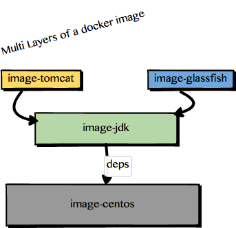
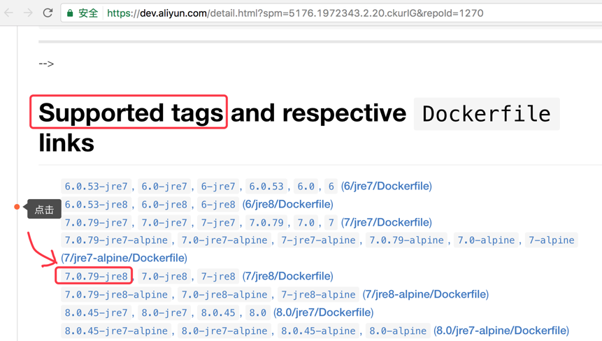

# Docker 镜像中心

<!-- TOC depthFrom:1 depthTo:6 withLinks:1 updateOnSave:1 orderedList:0 -->

- [Docker 镜像中心](#docker-镜像中心)
	- [课程目标](#课程目标)
	- [国内镜像地址](#国内镜像地址)
	- [Image 寻址](#image-寻址)
	- [下载镜像](#下载镜像)
		- [Pull an image from Docker Hub](#pull-an-image-from-docker-hub)
		- [Pull from a different registry](#pull-from-a-different-registry)
	- [镜像分层](#镜像分层)
	- [设置代理](#设置代理)
	- [下载Tomcat](#下载tomcat)
	- [参考资料](#参考资料)

<!-- /TOC -->

**温馨提醒**

>如果您第一接触``Docker``，请先阅读：[手把手体验DockerHelloWorld](手把手体验DockerHelloWorld.md)

在``Docker``领域，``镜像``一词有两个含义：
- ``Docker Image``: 它是用来运行出``Docker Container``的。比如``nginx image``，``tomcat image``，``nodejs image``等。
- ``Docker Registry Mirrors``: 为了让大家方便使用，不需要每个人都去制作``Docker Image``，我们可以分享：你制作一个``nginx image``，然后发布到``Docker Registry``去；我制作一个``tomcat image``，也发布出去。这样大家就可以快速拥有许多``Docker Image``。中心化的``Docker Registry``的好处是：资源集中，便于大家发现，减少重复劳动，通过社区推选出最优质的``Docker Image``（比如``nginx image``可能有100个人做了，但是经过社区的使用，慢慢社区会推选出最优秀的几个）。但是中心化的弊端是性能瓶颈，大家下载``image``的时候特别慢。于是需要``mirrors``（就是``Master-Slave``复制结构，以便做到写读分离，但是云厂商都想占据写源头，所以实际上各个厂商都会支持用户上传``image``，同时会从``docker.com``同步其他``image``）。

## 课程目标

本文的目标只有一个：``docker pull ${image-name}``的时候要快 ！！！
方式有两个：
- 仓库镜像：不要访问``hub.docker.com``了，换国内的（``Registry Mirrors``）。
- 设置代理：``Docker Daemon`` 可以设置代理，也可以读取环境变量``HTTP_PROXY``, ``HTTPS_PROXY``和``NO_PROXY``。

## 国内镜像地址

| Registry Mirrors | Web 界面地址 | Download 加速地址 | 备注 |
|------|-----|-----| ------ |
| Docker官方 | https://hub.docker.com/ | 内置在docker客户端 | 具有stars质量度和详细使用文档 |
| 阿里云 | https://dev.aliyun.com/search.html | 每个用户得单独创建专属地址，类似：123456.mirror.aliyuncs.com | 质量度认证：Docker和阿里云认证 |
| 网易蜂巢 | https://c.163.com/hub  | hub.c.163.com | ``docker pull hub.c.163.com/library/tomcat:latest`` |
| 国内创业：DaoCloud | https://dashboard.daocloud.io/packages/explore | daocloud.io | ``docker pull daocloud.io/library/tomcat`` |
| 国内创业：灵雀云 | https://hub.alauda.cn/ | registry.alauda.cn | ``docker pull registry.alauda.cn/tutum/tomcat`` |
| 国内创业：希云 | http://csphere.cn/hub/ | index.csphere.cn | ``docker pull index.csphere.cn/microimages/tomcat:8.0`` |
| 国内创业：时速云 | https://hub.tenxcloud.com/ | index.tenxcloud.com | ``docker pull index.tenxcloud.com/tenxcloud/tomcat`` |

**注意**
>阿里云的镜像加速器（123456.mirror.aliyuncs.com）是每个用户各用各的子域名。这个需要登陆阿里云，在Web控制台上提前生成。然后配置到``Docker Daemon``的``Registry Mirrors``里面。

## Image 寻址

唯一标识一个``Docker Image``，需要4个值：``Registry`` -> ``UserName(Uploader)`` -> ``ImageName`` -> ``Tag(Version)``。

之所以4个信息，是因为，比如我们拉取一个``tomcat``镜像：成千上万个用户都可以制作``tomcat``镜像，上百个服务商也都可以创建``Docker Registry``。


``` bash
$ docker pull tomcat # 表示 hub.docker.com 网站，官方账号（默认是library）发布的 tomcat 镜像的最新版本 tomcat:latest
$ docker pull bitnami/tomcat # 表示 hub.docker.com 网站，名叫 bitnami的用户，发布的 tomcat 镜像的最新版本
$ docker pull registry.alauda.cn/tutum/tomcat # 表示 registry.alauda.cn 网站，名叫 tutum 的用户，发布的 tomcat 最新版本
$ docker pull registry.alauda.cn/tutum/tomcat:8.0 # 表示 registry.alauda.cn 网站，名叫 tutum 的用户，发布的 Tomcat 8
$ docker pull index.csphere.cn/microimages/tomcat:8.0 # 跟上一条类似
```

**注意**
>``image-name:tag`` 中的``tag``未必是版本的意思。比如我们发布JDK的镜像，可以是JDK7的镜像，也可以是JDK8的镜像，对于JDK8的镜像，可能你第一次发的时候没有配置$JAVA_HOME环境变量，后来又修改了一下，配置了环境变量。这些都可以通过``tag``来区分。

## 下载镜像

### Pull an image from Docker Hub

``` bash
$ docker pull debian

Using default tag: latest
latest: Pulling from library/debian
fdd5d7827f33: Pull complete
a3ed95caeb02: Pull complete
Digest: sha256:e7d38b3517548a1c71e41bffe9c8ae6d6d29546ce46bf62159837aad072c90aa
Status: Downloaded newer image for debian:latest
```

命令``docker pull debian``是简写的方式，如果写全了应该是：

``` bash
$ docker pull hub.docker.com/library/debian:latest
```

### Pull from a different registry

``` bash
$ docker pull myregistry.local:5000/testing/test-image
$ docker pull registry.alauda.cn/tutum/tomcat:8.0 # 表示 registry.alauda.cn 网站，名叫 tutum 的用户，发布的 Tomcat 8
```

## 镜像分层

镜像分层大意是这样的：

比如我们有个：（1）基础镜像是``CentOS``；（2）接着在上面安装了一个``JDK``，以便可以运行普通的Java程序，发布一个新的镜像叫``image-jdk``；（3.1）再在``image-jdk``上，安装一个``Tomcat``，以便能够跑Web应用，又发布一个镜像叫``image-tomcat``；（3.2）有人不习惯``Tomcat``，他在``image-jdk``上，安装了一个``GlassFish``，也可以跑Web应用，于是发布了一个``image-glassfish``。



看到这里，你会发现，它非常类似包管理时的依赖管理（具有传递性）：比如Java中的``maven``管理``*.jar``包，再比如node.js中的``npm``管理``node modules``。

这样做的好处非常明显：提高复用性，介绍存储和传输空间。比如我们先``docker pull image-tomcat``，这个时候会下载3个小单元，分别是：底层的``CentOS``,中层的``image-jdk``和上层的``image-tomcat``。再当我们``docker pull image-glassfish``的时候，发现底层的``CentOS``和中层的``image-jdk``前面已经下载过，不用再下了，可直接下载上层的``image-glassfish``。

所以我们看``docker pull debian``的日志，会有两个片段：

```
$ docker pull debian

Using default tag: latest
latest: Pulling from library/debian
fdd5d7827f33: Pull complete
a3ed95caeb02: Pull complete
```

第一片段``fdd5d7827f33: Pull complete``和``a3ed95caeb02: Pull complete``。

## 设置代理

在``Docker for Mac``的``Daemon``程序上，点击：``Preferences`` -> ``Proxies`` 即可


## 下载Tomcat

笔者把镜像服务器配置为阿里云专属的，在配置下代理（如果你所在的环境需要代理才能上外网的话），然后：

``` bash
$ docker search tomcat
NAME                           DESCRIPTION                                     STARS     OFFICIAL   AUTOMATED
tomcat                         Apache Tomcat is an open source implementa...   1428      [OK]
consol/tomcat-7.0              Tomcat 7.0.57, 8080, admin/admin             16                   [OK]
```

我们搜索``tomcat``，然后发现有很多，笔者选了两条，第一条拥有1428个STARS，同时OFFICIAL=[OK]表明是官方发布（这里的官方是指``docker.com``，而不是阿里云）。

如果我们直接运行``docker pull tomcat``也可以，但是我们无法知道这个``tomcat``是``tomcat-7``呢？还是``tomcat-8``？它依赖的JDK是7呢，还是8呢？

另外，下载后，我们怎么知道怎么使用它呢？image是不是会描述它的用法？

关于这些问题，最好的办法还是上Web控制台，比如：https://dev.aliyun.com/list.html?namePrefix=tomcat

然后可以找到``Supported tags``，我们选择``7.0.79-jre8``，继续点击可查看它的``Dockerfile``描述，就可以知道怎么用了。



``` bash
$ docker pull tomcat:7.0.79-jre8

7.0.79-jre8: Pulling from library/tomcat
06b22ddb1913: Pull complete
336c28b408ed: Pull complete
1f3e6b8d80c3: Pull complete
aeac59510475: Pull complete
b01db8bd8540: Pull complete
f7f398af5fea: Pull complete
1c5595fa1317: Pull complete
e1a6cc83dc3d: Pull complete
9efe1c932022: Pull complete
eef936b7f842: Pull complete
3c1e71063aec: Pull complete
1f55c7359164: Pull complete
fc4f5c3be8ed: Pull complete
Digest: sha256:92f2451fc09e6973a9886f6ea8e3b5cb49a5d9aa0d074c218f70ee33596ba738
Status: Downloaded newer image for tomcat:7.0.79-jre8

$ docker images
REPOSITORY                             TAG                 IMAGE ID            CREATED             SIZE
tomcat                                 7.0.79-jre8         b0280f28ef9b        16 hours ago        293 MB

```

它的Layers很多，总大小 293MB。


## 参考资料

- [官方详解 docker pull 命令](https://docs.docker.com/engine/reference/commandline/pull/)
- [阿里云镜像搜索Tomcat](https://dev.aliyun.com/detail.html?spm=5176.1972343.2.20.ckurIG&repoId=1270)
- [Tomcat7-JRE8的使用说明](https://github.com/docker-library/tomcat/blob/e45349ec3432c75ca5b7e2ef4cae95276c7dccc7/7/jre8/Dockerfile?spm=5176.1972344.1.9.EvOLsj)
