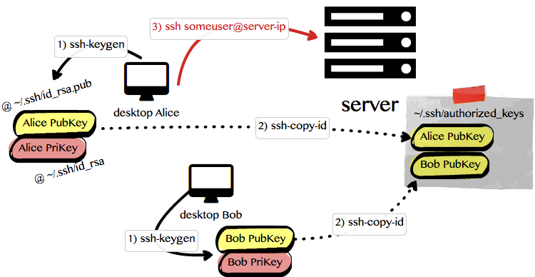
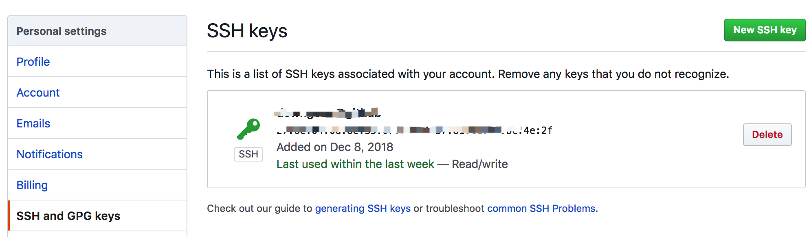
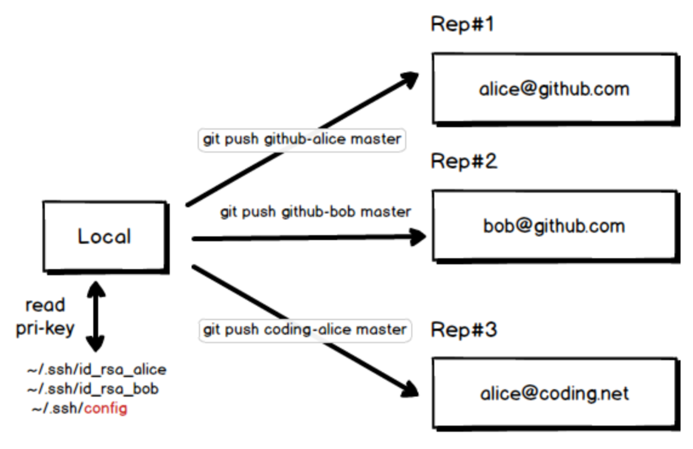

# SSH登录与Github多仓备份

[TOC]

## 私钥登陆

日常SSH认证[1]，主要有两种方式：
- 一个是账号密码；
- 另一个是``private key``。

**注意**

>其实并不是 ``public key``，只不过运维给我们开通权限的时候总是问我们提供``public key``，就被大家误以为是``公钥登陆``。实际上认证的时候是用``private key``，用的是签名（签名用``private key``，验签是用``public key``）。

多数大公司SSH登陆方式是：先通过``private key``登陆跳板机，再穿梭到其他主机。

**自动读取私钥**

>当我们输入：``ssh someuser@10.10.1.234`` 时，``ssh``会自动读取``~/.ssh/id_rsa``文件（这个文件就是``private key``），以这个验证身份。

## 用图示意



如图有三步，后续文字想详讲它们。

> **提醒**： 上图表明，如果要保证第3步能成功登录服务器，必须事先在第2步把公钥放置到服务器的``~/.ssh/authorized_keys``文件里面。

## 生成私匙

为了申请登陆服务器，运维通常会要求我们提供自己的``公钥``。我们需要生成``秘钥对``，然后把``私钥``保密，把``公钥``给运维。
你可能会问：为什么运维不帮你生成``秘钥对``呢？然后把``私钥``给你，你放到``~/.ssh/id_rsa``位置不就行了么？的确是可以的。只不过那样就失去安全意义了。你的``私钥``都交给运维了，那你的账号做了些破坏性操作时，并不能证明操作人就是你。

生成``秘钥对``，用``ssh-keygen``命令就好：

``` bash
$ ssh-keygen

按提示，输入必要信息。最后私钥生成到 ~/.ssh/id_rsa，公钥是 ~/.ssh/id_rsa.pub
```
**注意**
>如果您担心``私钥``直接放在本机的``~/.ssh/id_rsa``文件怕别人看见，您还可以给``私钥``加个口令（就是查看它的时候，需要输入一个口令）。另外通常私钥文件的访问权限是``chmod 700 ~/.ssh/id_rsa``（只有文件的owner才能``rwx``）。

## 分发公钥

假设有两个Linux主机，分别命名叫C和S，现在要 **从C登陆到S** 上。如何配置？

- 私钥文件： 在C的 ``~/.ssh`` 中要保存“私钥”，文件名为 ``~/.ssh/id_rsa``。
- 分发公钥： 在S的 ``~/.ssh/authorized_keys`` 文件中得追加C的 ``public key``。

 ``` bash
cat id_rsa.pub >> ~/.ssh/authorized_keys
 ```

 >注意：``id_rsa.pub``是C的，``authorized_keys``是S的。

- 更新权限：在S的 ~/.ssh 执行chmod 0600 *

## Github的SSH认证

### 通过SSH认证提交代码

往GitHub 提交代码，通常有两种协议：SSH和HTTPS。其中HTTPS需要我们输入或配置账号和密码进行认证，而SSH方式都是通过``私钥``认证。为此，需要在settings页设置SSH Public Key（把刚才生成的~/.ssh/id_rsa.pub内容拷贝到网页表单中），如图：



假设一个叫alice的账号，在GitHub 上创建了一个hello-world项目，那么它的git地址是：``git@github.com:alice/hello-world.git``

``` bash
$ git clone git@github.com:alice/hello-world.git  # 下载代码到本地
$ git remote -v # 查看远程仓库地址
origin	git@github.com:alice/hello-world.git (fetch)
origin	git@github.com:alice/hello-world.git (push)
$ git push origin master  # 提交代码到GitHub远程

```

当在本地执行``git push origin master``命令的时候，默认就会读取``.ssh/id_rsa``私钥进行签名，以便服务端验证。

### 多仓库多账号备份代码

上节说了默认读取``.ssh/id_rsa``文件，那如何指定读取别的文件呢？什么时候需要读取别的私钥文件呢？

我们知道git是去中心化的，除了能够离线工作外，还能备份到多个远程仓库。比如可以同时备份到国外的``github.com``，``gitlab.com``或``bitbucket.org``；再有国内的``coding.net``或``/gitee.com``。我们构造了个例子：



本地一份代码，想同时备份到3个远程仓库，其中：

- Resp#1是github.com的alice账号
- Resp#2依然在github.com上，但账号换成了bob
- Resp#3备份到国内的coding.net上，也用alice账号

在本地生成两对密钥对，分别是alice（包括``~/.ssh/id_rsa_alice``和``~/.ssh/id_rsa_alice.pub``）和bob（包括``~/.ssh/id_rsa_bob``和``~/.ssh/id_rsa_bob.pub``），并把公钥填写到三个远程仓库上。


在本地Local仓库，编辑``.git/config``文件，增加节点内容：

``` ini
[remote "github-alice"]
        url = git@github.com:alice/hello-world.git
        fetch = +refs/heads/*:refs/remotes/origin/*

[remote "github-bob"]
        url = git@github-bob:bob/hello-world.git
        fetch = +refs/heads/*:refs/remotes/origin/*

[remote "coding-alice"]
        url = git@git.coding.net:alice/hello-world.git
        fetch = +refs/heads/*:refs/remotes/origin/*
```

配置完后，再查看远程仓库，就多出3个了：

``` bash
$ git remote -v
github-alice	git@github.com:alice/hello-world.git (fetch)
github-alice	git@github.com:alice/hello-world.git (push)
github-bob	git@github-bob:bob/hello-world.git (fetch)
github-bob	git@github-bob:bob/hello-world.git (push)
coding-alice	git@git.coding.net:alice/hello-world.git (fetch)
coding-alice	git@git.coding.net:alice/hello-world.git (push)
```


> **关键问题**来了，当执行``git push``的时候，系统是如何选择对应的私钥文件的呢？
>
> 细心的同学会发现：
>
> - Resp#1的URL地址是``git@github.com:alice/hello-world.git``，主机部分是``github.com``；
> - 而Resp#2的URL地址是``git@github-bob:bob/hello-world.git``，主机部分却是``github-bob``，**它不是一个真正意义上的主机名，公网是不承认的**。的确，它是一个``本地别名``！
>
> 这个``本地别名``在哪里配置呢？答案是SSH Config文件，即： ``~/.ssh/config``。

这里插播下SSH Config的语法知识：

``` idl
Host github.com github-alice # 主机别名：可以跟真实主机名相同，还可以有多个别名，以空格隔开。
  HostName github.com # 真实主机名：必选参数，可以是域名或IP。
  Port 22 # 端口号：可选参数，默认值 22
  User git # 用户名：用于认证的用户名，github的SSH方式，用户名必须是git，而不是alice或bob
  PreferredAuthentications publickey # 认证方式：可选参数
  IdentityFile ~/.ssh/id_rsa_alice  # 私钥文件：默认是~/.ssh/id_rsa，若用其他，必须在此指定
```

按这个语法知识，编辑``~/.ssh/config``文件，添加内容：

``` ini
# 多仓库多账号备份

Host github.com github-alice
  HostName github.com
  User git
  PreferredAuthentications publickey
  IdentityFile ~/.ssh/id_rsa_alice

Host github-bob
  HostName github.com
  User git
  PreferredAuthentications publickey
  IdentityFile ~/.ssh/id_rsa_bob

Host git.coding.net coding-alice
  HostName git.coding.net
  Port 22
  User git
  PreferredAuthentications publickey
  IdentityFile ~/.ssh/id_rsa_alice
```


接着指定Push指令：

``` bash
$ git push github-alice master
$ git push github-bob master
$ git push coding-alice master
```

以``git push github-bob master``为例解释下，git客户端看到``github-bob``会在``git remote -v``里面选出远程git仓库地址：

``` bash
github-bob	git@github-bob:bob/hello-world.git (fetch)
github-bob	git@github-bob:bob/hello-world.git (push)
```

接着从``git@github-bob:bob/hello-world.git``中提取出主机名``github-bob``，这个主机名需要查``~/.ssh/config``本地别名表，查到：

``` ini
Host github-bob
  HostName github.com
  User git
  PreferredAuthentications publickey
  IdentityFile ~/.ssh/id_rsa_bob
```

它真实的主机名是``github.com``，账号是``git``，私钥文件是``~/.ssh/id_rsa_bob``。

>最后简单总结下``多仓库多账号``备份：
>
>1. **多仓库备份需求**：为防丢失或加速，一份代码既想放GitHub，又想放国内的coding。通常一个人只需生成一对密钥对，在两个不同网站，填写同一个公钥。但有时候，可能各种原因，被迫多个密钥对。
>2. **Git Remote 支持主机别名**：设置git remote的URL地址时，主机名可以是非真实域名或IP，可以是别名。这个别名可在SSH Config中定义。
>3. **为主机别名指定私钥**：在SSH Config中定义主机别名，并为其指定真实主机域名或IP，同时指定私钥文件。

## 参考资料

- [Java SSH 工具包（JSCH） 深入浅出](http://xliangwu.iteye.com/blog/1499764)
- [JSCH Demo 代码](http://xliangwu.iteye.com/blog/1499764)
- [如何配置private key 登陆方式？](http://xliangwu.iteye.com/blog/1499764)
- [免密登陆](http://blog.chinaunix.net/uid-26284395-id-2949145.html): ssh-keygen,ssh-copy-id和authorized_keys
- [如何通过SSH访问mysql ?](http://stackoverflow.com/questions/1968293/connect-to-remote-mysql-database-through-ssh-using-java)
- [跳板机](http://blog.csdn.net/mdl13412/article/details/8986412): 登陆跳板机时，需要动态密码
- [SSH Tunnel 隧道](http://blog.csdn.net/blade2001/article/details/8877250)
- [反向隧道](http://my.oschina.net/abcfy2/blog/177094)
- [SSH 正向/反向隧道](http://blog.csdn.net/quqi99/article/details/7334617)
- [SSH 隧道](http://blog.csdn.net/zenghui08/article/details/7896520)
- [多层 SSH隧道](http://wenku.baidu.com/link?url=8rK3IwF8kH-mV45yU7Edbd9iKc45PJuLzdRF1djWt9TwFkwkX78lYF7kjx0ZWtyI-Bbn8EO4_WD-TKqrTOZb5GsvuYkQ-vnbv9ySegVgfIi)
- [配置多份GitHub SSH密钥](https://blog.csdn.net/qq_34149581/article/details/72369498)
- [Github邮箱账号隐私与GitLog冲突](https://blog.csdn.net/hangxingkong/article/details/51781263)
- [一条命令同时Push多个仓库](https://blog.csdn.net/marvellousbinary/article/details/79857102)
