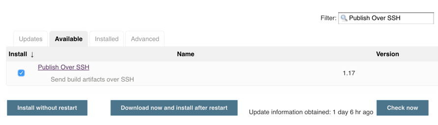

# jenkins自动部署普通Java

**温馨提醒**

>如果您之前没怎么用过Jenkins，请先阅读：[jenkis自动部署到Tomcat](jenkis自动部署到Tomcat.md)

## 安装插件

- [Publish Over SSH](https://plugins.jenkins.io/publish-over-ssh)：实验版本是1.17，作用借助SSH通道远程执行Shell脚本

点击 ``jenkins`` -> ``Manage Jenkins`` -> ``Manage Plugins`` -> ``Available`` 搜索 ``Publish Over SSH``：

## 参考资料

- 
- [Publish Over SSH插件](http://www.cnblogs.com/zz0412/p/jenkins_jj_10.html)：关于Publish Over SSH 的公共配置与项目配置
- [Jenkins+Docker 自动部署node.js应用](http://www.jianshu.com/p/052a2401595a)
