# jenkis自动部署到Tomcat

<!-- TOC depthFrom:1 depthTo:6 withLinks:1 updateOnSave:1 orderedList:0 -->

- [jenkis自动部署到Tomcat](#jenkis自动部署到tomcat)
	- [教程目标](#教程目标)
	- [安装插件](#安装插件)
	- [创建Job](#创建job)
		- [配置源代码](#配置源代码)
		- [配置编译打包](#配置编译打包)
		- [配置war部署](#配置war部署)
		- [触发构建](#触发构建)
		- [访问测试](#访问测试)
	- [小结展望](#小结展望)
	- [附录-1：Tomcat Manager](#附录-1tomcat-manager)
	- [参考资料](#参考资料)

<!-- /TOC -->

## 教程目标

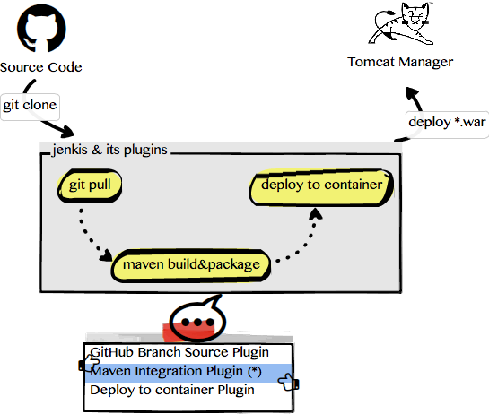

如上图所示，自动化部署Java Web App到Tomcat的整体流程是：
- 拉取代码：jenkins [GitHub Branch Source Plugin](https://wiki.jenkins.io/display/JENKINS/GitHub+Branch+Source+Plugin) 从 [GitHub](https://github.com) 或者 gitlab 拉取代码。
- 编译打包：代码拉取到Jenkis所在的机器后，再由 jenkins [Maven Integration Plugin](https://wiki.jenkins.io/display/JENKINS/Maven+Project+Plugin) 负责执行``maven``编译和打包工作，并生成``target/*.war``包。
- 容器部署：最后由 jenkins [Deploy to container Plugin](https://wiki.jenkins.io/display/JENKINS/Deploy+Plugin) 负责把``*.war``包，推送到``tomcat manager``上，由``tomcat manager``负责热部署。

>以上三步都是由jenkins的插件来完成的，我们需要提前安装这3个插件。然后在jenkins界面上创建一个类型为``Maven Project``的``Job``，把它们3者串起来。


## 安装插件

需要安装的3个插件如下：

- [GitHub Branch Source Plugin](https://wiki.jenkins.io/display/JENKINS/GitHub+Branch+Source+Plugin)：负责从GitHub或GitLab来取代码
- [Maven Integration Plugin](https://wiki.jenkins.io/display/JENKINS/Maven+Project+Plugin)：负责用``maven``进行编译和打包
- [Deploy to container Plugin](https://wiki.jenkins.io/display/JENKINS/Deploy+Plugin)：负责把``*.war``包推送到``tomcat manager``

**注意**
>本教程实验的Jenkins版本是：2.7.1 on Mac

点击 ``Jenkins`` -> ``Manage Jenkins`` -> ``Manage Plugins``，以便安装插件和查看已经安装的插件：

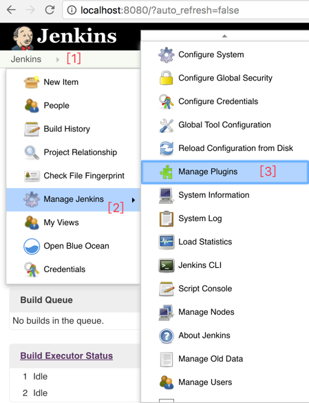

比如以安装好的[Maven Integration Plugin](https://wiki.jenkins.io/display/JENKINS/Maven+Project+Plugin)为例：

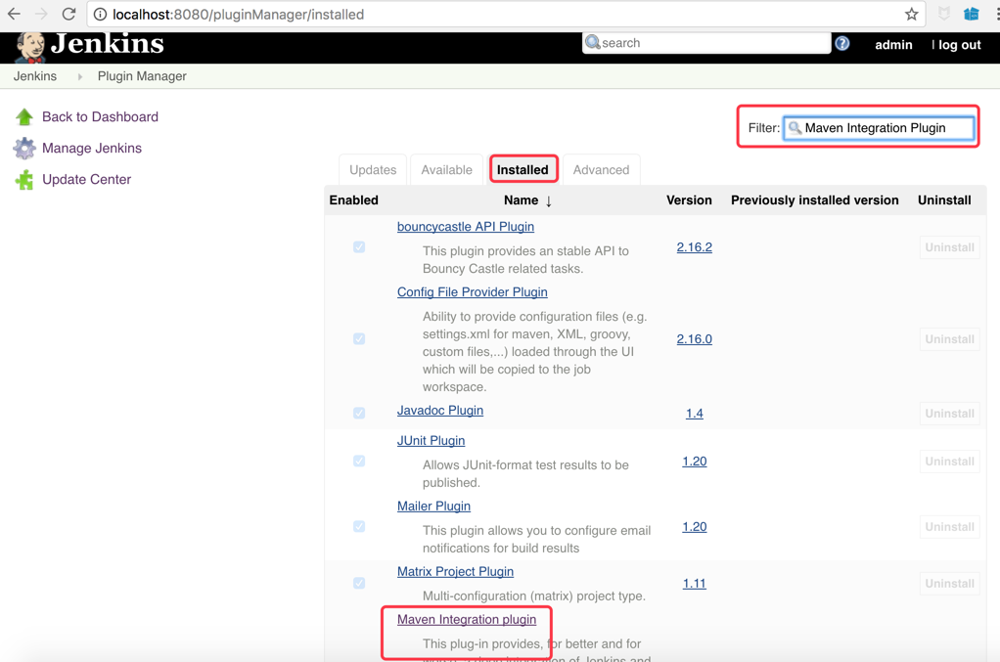

## 创建Job

在``Jenkins``里，``Job``就是一种流程，它由若干个环节组成，每个环节可以借助``Plugin``来完成。

我们点击：``Jenkins`` -> ``New Item`` -> ``Maven Project``

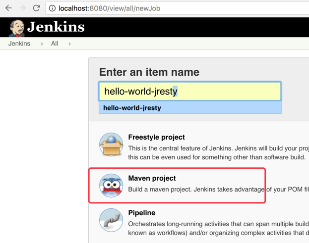


**温馨提醒**
>这里的``Job``类型要选择：``Maven Project``。在这个模板下，才能继承本教程目标图片的流程。

``Maven Project``模板张这样子的：http://localhost:8080/me/my-views/view/all/job/hello-world-jresty/configure


模板包括若干步骤：
- ``General``: 描述任务名称和详情等。
- ``Source Code Management``：填写源代码地址，比如 github上的项目地址和访问密码等。
- ``Build Triggers``: 构建触发器。用来配置什么时候对项目进行``build``一次。常见的有：定时执行（比如每天晚上22:00），GitHub Hook（比如每次有人提交一次代码到master分支就触发一次）等。
- ``Build Environment``: 编译打包时的环境变量。因为拉取代码，并且编译打包，是运行在``Jenkins``集群上的（Master和Slave），比如要编译打包Java项目，那至少每个机器上都得安装JDK和Maven工具，并且设置好JAVA_HOME和M2_HOME之类的环境变量。
- ``Pre Steps``: 编译前拦截器。
- ``Build``: 编译打包相关配置，比如``maven``命令：``mvn clean package -Pop``，表示编译，并且打包，同时环境用op环境。当然如果你要跳过单元测试，也可以修改这条命令，以便跳过单元测试。
- ``Post Steps``: 编译后的拦截器。
- ``Build Settings``: 目前看只有是否启用``Email``通知。以便把每次构建成功或失败的结果通过邮件通知给项目组成员。
- ``Post-build Actions``: 编译后的拦截器，并且支持第三方拓展。比如这里的[Deploy to container Plugin](https://wiki.jenkins.io/display/JENKINS/Deploy+Plugin) 安装后，会加入到 [Maven Integration Plugin](https://wiki.jenkins.io/display/JENKINS/Maven+Project+Plugin) 模板里面。

对于本例而言，最重要的两个环节是：``Source Code Management`` 和 ``Post-build Actions``。

### 配置源代码

在 ``Source Code Management`` 选项卡中填写 GitHub 项目地址，为了实验方便，我们选用一个开源项目 [hello-world-jresty](https://github.com/downgoon/hello-world-jresty)，它符合J2EE的WebApp规范，会打包为``*.war``格式。


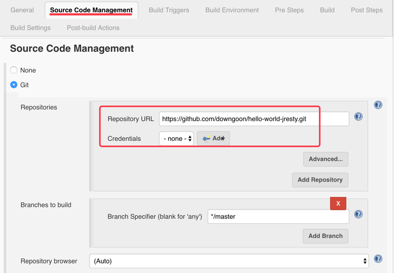

如图填写：

- Repository URL: https://github.com/downgoon/hello-world-jresty.git
- Credentials: NONE  （因为是开源项目，所以谁都可以读取，无需秘钥）
- Branches to build： ``*/master``  （默认拉主干的代码，当然我们也可以配置为取分支的代码）

### 配置编译打包

在 ``Build`` 选项卡中填写``mvn clean pacakge -Pop``：

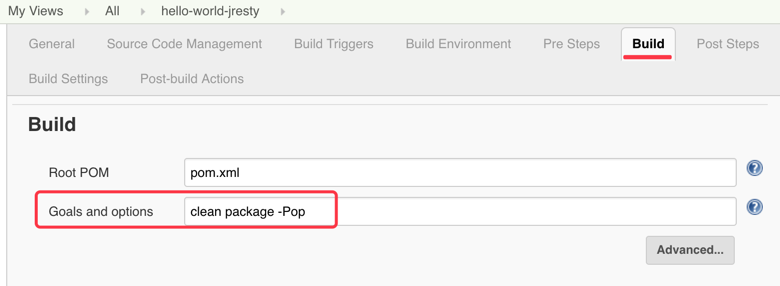

### 配置war部署

在 ``Post-build Actions`` 选项卡中继续选择：``Add Post-build action`` -> ``Deploy war/ear to a container``

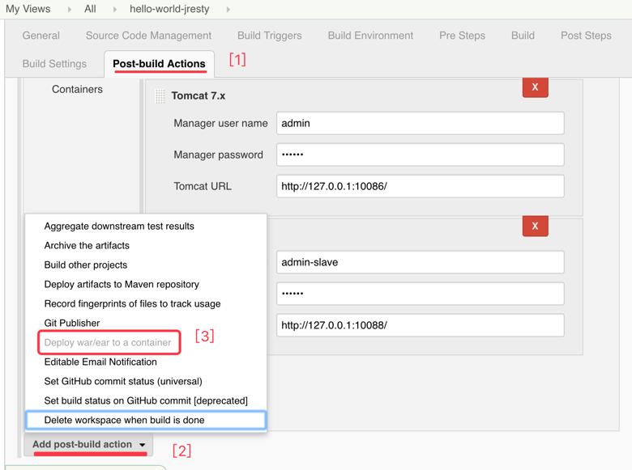

接着我们配置把生成的``.war``推送到两个tomcat容器（生产环境往往都是多实例部署的）：

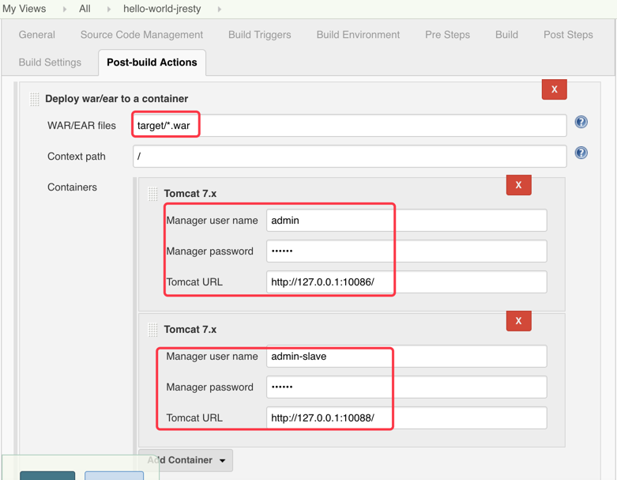

其中有三个选项：

- ``WAR/EAR files``: 填写 ``target/*.war``，之所以用通配符，是因为版本变更的时候，生成的``hello-world-jresty-1.0.0.war``或``hello-world-jresty-1.1.0.war``，名字会不一样。
- ``Context path``: 填写``/``。它表示Tomcat下部署的App的根路径，因为Tomcat是可以部署多个App的，可以给不同的App分配不同的根路径。比如这里我们也可以填写``/mypath``，这样我们访问App的时候，都要加前缀路径。比如原来是``http://localhost/abc``的，访问路径需变更为``http://localhost/mypath/abc``。
- ``Containers``：可配置1或多个容器。只要点``Add Containers``就可以，还可以选择不同的容器，比如一些选Tomcat，另一些选``Glass Fish``等。本实验选定的是``Tomcat 7``，需要在这里配置``Tomcat manager``的账号和密码。

**温馨提醒**
>如果对``Tomcat manager``不太熟悉，请查看 [附录-1：Tomcat Manager](#附录-1tomcat-manager)。

### 触发构建

对于创建好的``Jobs``，可以在首页左侧栏的 ``My Views`` 查看``Job``列表：

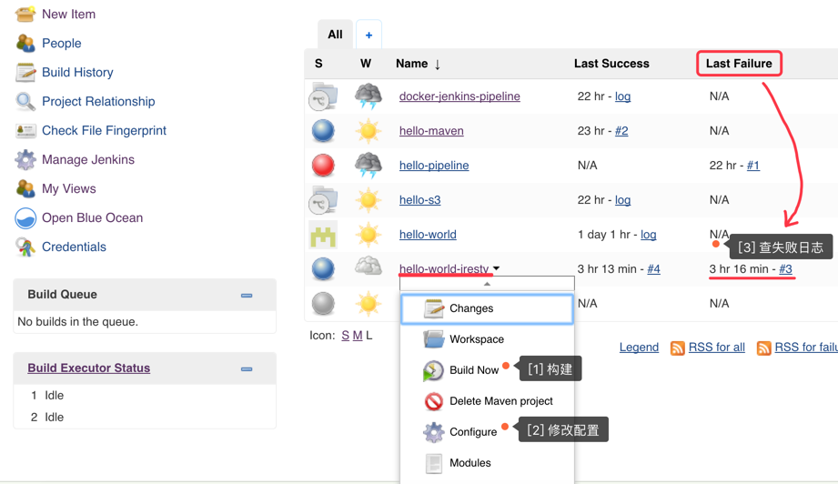

在任务右边小下拉按钮中，点击``Build Now``就可以开始构建了。

当然列表会展现出：最后一次 **成功** 的构建（包括连接和时间），最后一次 **失败** 的构建，对于失败的构建，可以点进去查看``Console Output``。

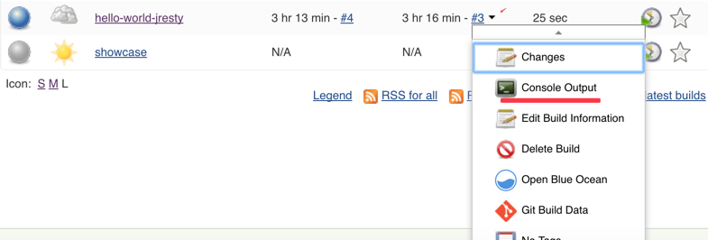

**温馨提醒**
>触发构建前，一定必须先启动Tomcat服务。否则最后一步推送war是不能成功的。

### 访问测试

如果一切部署好，则可以分别访问两台Tomcat上提供的API接口服务：

```
$ curl http://localhost:10086/jresty/ping.json -i
$ curl http://localhost:10088/jresty/ping.json -i
```


## 小结展望

本文对``.war``形式的WebApp实现了自动部署，重点依赖``Jenkins``的 [Maven Integration Plugin](https://wiki.jenkins.io/display/JENKINS/Maven+Project+Plugin) 插件，同时辅助[GitHub Branch Source Plugin](https://wiki.jenkins.io/display/JENKINS/GitHub+Branch+Source+Plugin)和[Deploy to container Plugin](https://wiki.jenkins.io/display/JENKINS/Deploy+Plugin)。

但是，有几个问题：

- 模板死板：本文的模板完全由 [Maven Integration Plugin](https://wiki.jenkins.io/display/JENKINS/Maven+Project+Plugin) 提供，并不是 Jenkins 本身提供的，而且需要手动配置。在 Jenkins 2 中提出了``Pipeline as code``的概念和框架，在Jenkins层面，支持把多个插件的任务融合在一起，同时可以用代码描述，我们可以把这个描述文件``Jenkinsfile``分享给其他人，就可以把流程分享出去了（类似``Dockerfile``）。
- 依赖Tomcat Manager: 这里自动部署的最后一个环节其实是需要依赖特定的应用类型的，比如Tomcat Manager。试想下，如果是普通的java程序呢？没有类似Tomcat Manager热部署容器支持，又如何自动部署呢？用脚本？比如``Ansible``。
- 不包含机器资源：刚才的自动化是建立在机器已经申请好了，域名也配置好了，并且Tomcat 也提前运行好了。但是现实上线过程中，申请机器等工作也是相当消耗时间的，类似这种完全自动部署的，就需要借助``Docker``了。``jenkins-2``就重点解决从CI到CD的问题。

## 附录-1：Tomcat Manager

``Tomcat Manager``是``Tomcat``的管理器，能热部署``*.war``包等。

``Tomcat``是符合J2EE的Servlet规范的Web容器，Web以``.war``包形式发布。我们可以想象一下，如果把Tomcat当做是iphone，那么``.war``就是iphone上的App，这样我们还缺少一个类似iphone的``AppStore``的东西，以便Tomcat能够直接从 ``warStore``直接下载应用并运行。但是时代的原因，Java Web的年代，互联网尚未高度发达，于是他们当时没有想到需联网的``warStore``，而是想到了不联网的``Tomcat Manager``：``Tomcat``上弄个manager组件，用户把``.war``直接上传到manager就可以。

但是``Tomcat Manager``默认是不启动的，需要专门启动。

- 下载Tomcat7

``` bash
$ wget http://www-us.apache.org/dist/tomcat/tomcat-7/v7.0.79/bin/apache-tomcat-7.0.79.tar.gz
```

- 配置Manager

编辑 ``apache-tomcat-7.0.79/conf/tomcat-users.xml`` ，内容如下：

``` xml
<?xml version='1.0' encoding='utf-8'?>
<tomcat-users>
  <role rolename="manager-gui"/>
  <role rolename="manager-script"/>
  <user username="admin" password="123456" roles="manager-script,manager-gui"/>
</tomcat-users>
```

上述配置，创建了一个账号名为``admin``，密码为``123456``的用户，它的角色是``manager-gui``和``manager-script``。这两个角色名是``Tomcat``预定义的，它们就具有热部署权限。

关于``rolename``的取值范围和权限，只有4种：

``` text
manager-gui
      允许访问html接口(即URL路径为/manager/html/*)
manager-script
      允许访问纯文本接口(即URL路径为/manager/text/*)
manager-jmx
    允许访问JMX代理接口(即URL路径为/manager/jmxproxy/*)
manager-status
允许访问Tomcat只读状态页面(即URL路径为/manager/status/*)
```


- 修改HTTP端口

编辑 ``apache-tomcat-7.0.79、conf/server.xml`` ，内容如下：

``` xml
<Server port="8005" shutdown="SHUTDOWN">

<Connector port="8080" protocol="HTTP/1.1"
               connectionTimeout="20000"
               redirectPort="8443" />

<Connector port="8009" protocol="AJP/1.3" redirectPort="8443" />
```

**温馨提醒**
>在一个机器上启动两个Tomcat实例的时候，需要注意：Tomcat默认会启动3个端口，而不是1个。否则，启动第二个端口的时候，会提示端口被占用，即便您已经修改了HTTP端口。
> - 管理端口：``Server port="8005"``，类似Watchdog机制，可以给它发送远程控制指令，比如关掉某个应用。
> - HTTP端口：``Connector port="8080"``，提供HTTP服务的。
> - AJP端口：``Connector port="8009"``，提供AJP服务的。AJP服务用在哪呢？早期Apache Httpd做反向代理时，转发到Tomcat就可以用AJP协议。但是随着Nginx的流行，AJP几乎没有多少人用了。


- 启动Tomcat

``` bash
$ cd apache-tomcat-7.0.79
$ bin/startup.sh
```

- 访问Tomcat Manager

在浏览器中输入： http://localhost:8080

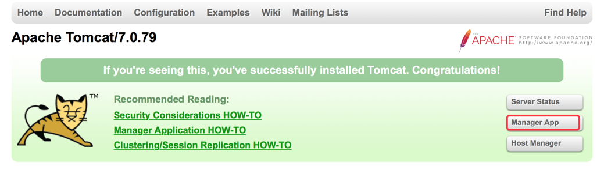

当配置了``tomcat-user.xml``后，会在首页看到``Manager App``的管理入口。

## 参考资料

- [git+jenkins+maven+deploy+tomcat自动化部署](http://www.cnblogs.com/520playboy/p/6258150.html)
- [「Jenkins+Git+Maven+Shell+Tomcat持续集成」经典教程](https://segmentfault.com/a/1190000002895521)
- [Jenkins GitHub Integration Maven Project](https://www.youtube.com/watch?v=biH1tPx4Z7g)
- [Tomcat Manager](http://blog.csdn.net/u010571844/article/details/46234073)
- [tomcat-7.0 manager-howto](https://tomcat.apache.org/tomcat-7.0-doc/manager-howto.html)
