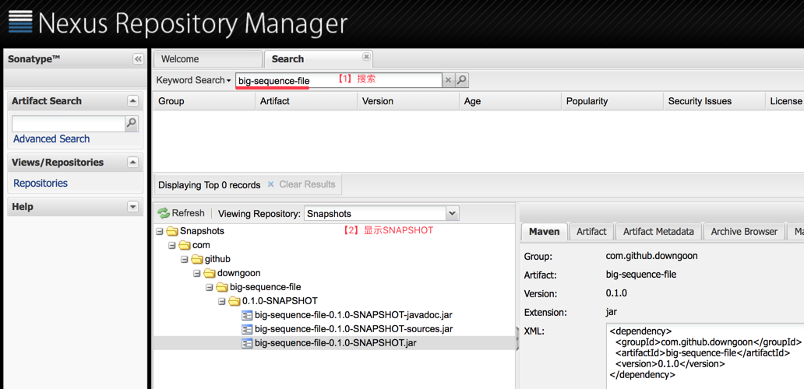
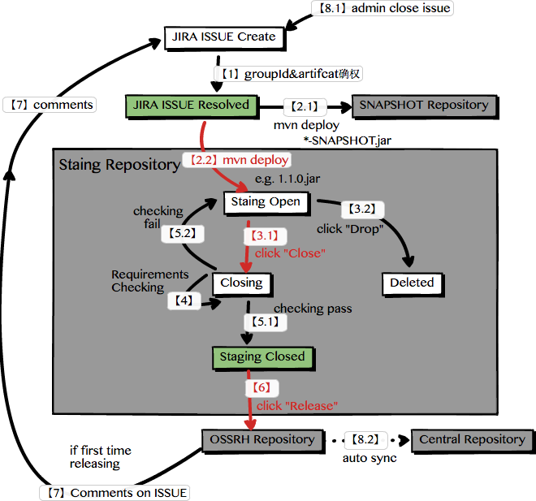
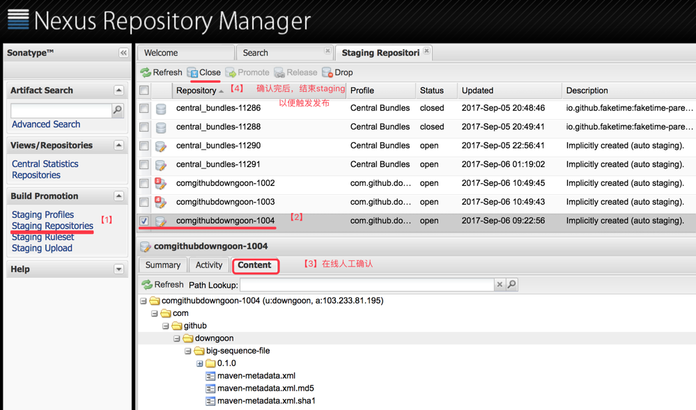
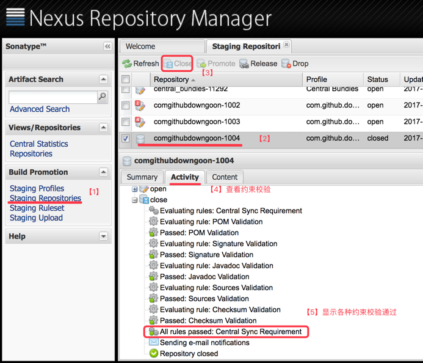
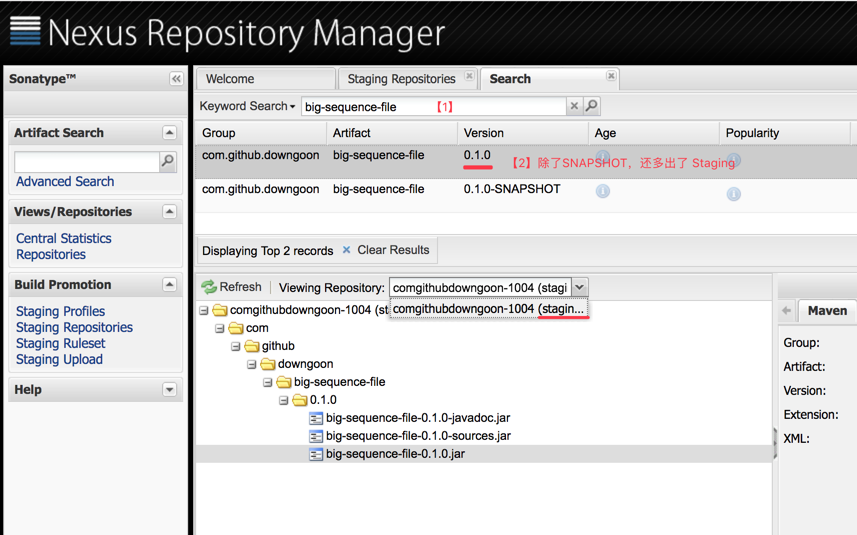
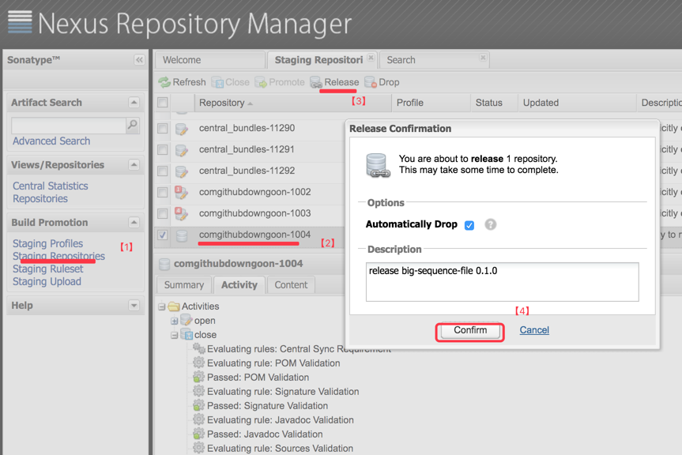
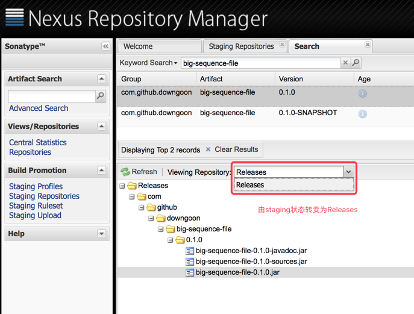
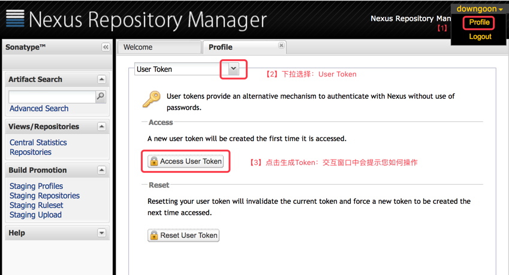
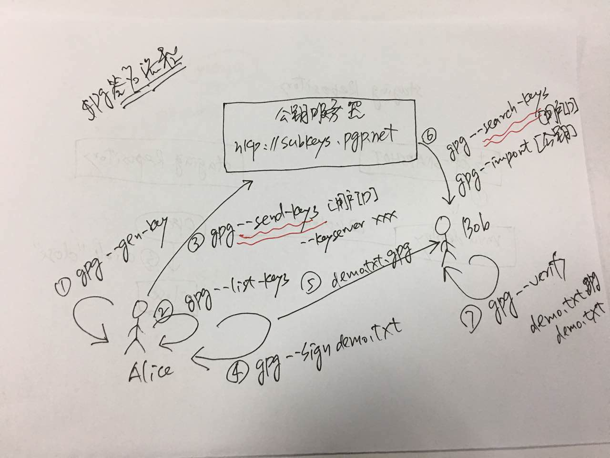

# 发布``jar``包到中央库的流程

<!-- TOC depthFrom:1 depthTo:6 withLinks:1 updateOnSave:1 orderedList:0 -->

- [发布``jar``包到中央库的流程](#发布jar包到中央库的流程)
	- [准备阶段](#准备阶段)
		- [注册账号](#注册账号)
		- [创建工单](#创建工单)
	- [发布阶段](#发布阶段)
		- [上传``SNAPSHOT``版本](#上传snapshot版本)
		- [上传``RELEASE``版本](#上传release版本)
			- [执行deploy命令](#执行deploy命令)
			- [点击Close按钮](#点击close按钮)
			- [查看约束校验](#查看约束校验)
			- [点击RELEASE](#点击release)
			- [OSSRH搜索jar](#ossrh搜索jar)
			- [评论工单激活同步](#评论工单激活同步)
	- [使用阶段](#使用阶段)
		- [搜索``jar``](#搜索jar)
		- [依赖引用](#依赖引用)
	- [回顾总结](#回顾总结)
	- [参考资料](#参考资料)
- [附录-1：项目配置](#附录-1项目配置)
	- [pom.xml 配置](#pomxml-配置)
		- [meta相关](#meta相关)
			- [坐标标识符](#坐标标识符)
			- [描述信息](#描述信息)
			- [开源许可](#开源许可)
			- [源代码托管](#源代码托管)
			- [开发者信息](#开发者信息)
		- [deploy相关](#deploy相关)
			- [Repository profile](#repository-profile)
			- [打包相关 plugins](#打包相关-plugins)
	- [settings.xml 配置](#settingsxml-配置)
		- [配置Repository账号密码](#配置repository账号密码)
		- [获取Repository账号密码](#获取repository账号密码)
		- [配置私钥口令](#配置私钥口令)
		- [配置代理服务](#配置代理服务)
- [附录-2：使用``gpg``加密与签名](#附录-2使用gpg加密与签名)
	- [签名流程](#签名流程)
	- [实战体验](#实战体验)
		- [签名](#签名)
		- [验签](#验签)
		- [加密](#加密)
		- [解密](#解密)
		- [gen-key](#gen-key)
		- [send-keys](#send-keys)
		- [seach-keys](#seach-keys)

<!-- /TOC -->

## 准备阶段

### 注册账号

在 [https://issues.sonatype.org/](https://issues.sonatype.org/) 网站，注册账号``downgoon``，密码简单常用。

### 创建工单

登陆后，点击``issues``，创建一个``issue``，形如：

- [jresty工单](https://issues.sonatype.org/browse/OSSRH-27329)
- [big-sequence-file工单](https://issues.sonatype.org/browse/OSSRH-34362)

**提醒**
>- 只有等工单的状态是``RESOVED``时，才可以去执行``mvn deploy``。
>- 工单类型为：``New Project``。
>- ``groupId``对应的域名，您得确保您有控制权。如何证明有域名的控制权，通常是在某个指定目录，按对方的要求放一个指定内容的文件。但是非``github``的情况下，``sonatype``的域名确权机制，笔者并未体验过。
>- 如果您之前发布过该``groupId``下的其他包，比如笔者之前发布过``com.github.downgoon``下的``jresty``包，那么``com.github.downgoon``这个``groupId``会立即可用，只需直接部署下一个``artifactId``即可，比如笔者的``big-sequence-file``。

## 发布阶段

``maven``发布``jar``到中央库，通常分两种包：
- ``SNAPSHOT``包：开发阶段的包以``-SNAPSHOT.jar``为后缀，可以理解发布。
- ``RELEASE``包：正式发布的包，通常是``X.Y.Z.jar``形式。为了防止误操作，它的发布过程通常需要在线确认。引入了一个``staging``的概念，执行``mvn deploy``后，首先进入``staging repository``，在线点击“确认”（准确的说是先“Close”，再“Release”）后，进入``OSSRH Repository``，并最终自动定期同步到``central repository``。

### 上传``SNAPSHOT``版本

在``pom.xml``中，设置``SNAPSHOT``版本

``` xml
<groupId>com.github.downgoon</groupId>
<artifactId>big-sequence-file</artifactId>
<version>0.1.0-SNAPSHOT</version>
<packaging>jar</packaging>
```

执行``mvn deploy``，项目开始上传到``SNAPSHOT Repository``，并显示日志：

``` log
Uploading: https://oss.sonatype.org/content/repositories/snapshots/com/github/downgoon/big-sequence-file/0.1.0-SNAPSHOT/big-sequence-file-0.1.0-20170906.012609-1.jar
```

上传完成后，登陆 [https://oss.sonatype.org](https://oss.sonatype.org)，可以立即查看到``SNAPHOST``版本的``jar``，如下图所示：




### 上传``RELEASE``版本

``SNAPHOST``开发版，可以立即发布；但是``RELEASE``版，为了防止误操作，需要先进入``staging``状态，发布者在线确认无误后，才可正式发布。全部流程如图所示：



上述流程图，用官方文字解释为：

>Once you are logged in you will be able to access the ``Build Promotion menu`` in the left hand navigation and select the ``Staging Repositories`` item. The Staging Repositories tab with a long list of repositories will be displayed.

>The staging repository you created during the deployment will have a name starting with the ``groupId`` for your projects with the dots removed appended with a dash and a 4 digit number. E.g. **if your project groupId is ``com.example.applications``, your staging profile name would start with ``comexampleapplications.``** The sequential numbers start at 1000 and are incremented per deployment so you could e.g. have a staging repository name of comexampleapplication-1010.

>After you deployment the repository will be in an ``Open`` status. You can evaluate the deployed components in the repository using the ``Contents tab``. If you believe everything is correct you, can **press the ``Close`` button** above the list. This will trigger the evaluations of the components against the requirements.

>Closing will fail if your components do not meet the requirements. If this happens, you can press ``Drop`` and the ``staging repository`` will be deleted. This allows you to correct any problems with the components and the deployment process and re-run the deployment. Details are available in the ``Activity tab`` below the list by selecting. Press on the individual steps for further details.

>Once you have successfully closed the staging repository, you can release it by **pressing the ``Release`` button**. This will move the components into the ``release repository`` of OSSRH where it **will be synced to the ``Central Repository``**.

>If you are releasing the **first time**, do not forget to **comment on the issue tracker ticket**, letting us know that you have completed a release so we can **activate your sync process**.

#### 执行deploy命令

执行``mvn deploy``命令，查看到日志：

``` log
[INFO] --- maven-deploy-plugin:2.7:deploy (default-deploy) @ big-sequence-file ---
Uploading: https://oss.sonatype.org/service/local/staging/deploy/maven2/xyz/downgoon/big-sequence-file/0.1.0/big-sequence-file-0.1.0.jar
```

如果你还想发布一份到公司的私服，在命令行选择``profile``：

``` bash
mvn clean deploy -P mycorprh
```

另外``jar``签名，需要访问私钥，私钥被口令保护，需要口令（当然也可以在``maven``的``settings.xml``中配置）：

``` bash
mvn clean deploy -P ossrh -Dgpg.passphrase=私钥口令
```

发布完一个版本后，想更新版本，再发布：

``` bash
mvn versions:set -DnewVersion=1.2.3
```

#### 点击Close按钮

点击``Close``按钮，以便触发``Requrements``校验（比如``pom.xml``中的作者呀，SCM信息呀，``jar``的签名呀）：



#### 查看约束校验



查看约束校验结果，如果通过了，则可以搜索到处于``staging``状态的``jar``包了：



#### 点击RELEASE

点击``RELEASE``按钮后，以便触发系统把``jar``从``staging``状态，推送到``release``状态：



#### OSSRH搜索jar

我们可以登陆 [https://oss.sonatype.org](https://oss.sonatype.org)，并搜索``big-sequence-file``，我们会发现状态已经变更为``release``了：




#### 评论工单激活同步

如果第一次发布，请在发布成功后，在JIRA ISSUE上，发布一个注释，以便JIRA管理员，关闭ISSUE。比如本例使用的 [OSSRH-34362](https://issues.sonatype.org/browse/OSSRH-34362)。

接着过些时间（大概一个工作日的样子），JIRA管理员会评论：

>**Central sync is activated** for com.github.downgoon. After you successfully release, your component will be published to Central, typically within 10 minutes, though updates to [search.maven.org](http://search.maven.org/) can take up to two hours.

**温馨提醒**
>请务必在ISSUE上评论，反馈给管理员，**否则同步到中央库的流程不会被激活**。

----

## 使用阶段

### 搜索``jar``

从发布评论告知管理员后，大概1个工作日后，能在在 [http://search.maven.org/](http://search.maven.org/) 搜索到发布的``jar``包。

### 依赖引用

``` xml
<dependency>
  <groupId>com.github.downgoon</groupId>
  <artifactId>big-sequence-file</artifactId>
  <version>0.1.0</version>
</dependency>
```

## 回顾总结

借助``Sonatype OSSRH``站点，可以把``jar``包，发布到``Maven``中央仓库。期间会涉及三个网站：

- [https://issues.sonatype.org/](https://issues.sonatype.org/)：创建工单，表明要发布一个``jar``包。
- [https://oss.sonatype.org](https://oss.sonatype.org)：上传``SNAPHOST``或``Release``版本的``jar``，后者还需要人工在线确认，以便从``staging``状态转到``release``。
- [http://search.maven.org/](http://search.maven.org/): 管理员依据工单，激活中央库同步功能，最终才能被全球搜索到。

## 参考资料

- [sonatype 官方开发者文档](http://central.sonatype.org/pages/releasing-the-deployment.html)：Close and Drop or Release Your Staging Repository
- [sonatype 官方视频教程](https://www.youtube.com/watch?v=b5D2EBjLp40&feature=youtu.be)

# 附录-1：项目配置

以 [big-sequence-file](https://github.com/downgoon/big-sequence-file) 项目为例，讲解``pom.xml``和``settings.xml``配置。

## pom.xml 配置

### meta相关

#### 坐标标识符

``` xml
<groupId>com.github.downgoon</groupId>
<artifactId>big-sequence-file</artifactId>
<version>0.1.0</version>
```

如果``SNAPHOST``，则``<version>0.1.0-SNAPHOST</version>``。

#### 描述信息

``` xml
<name>big-sequence-file</name>
<description>a big file providing sequential data access.</description>
<url>http://github.com/downgoon/big-sequence-file</url>
```

#### 开源许可

``` xml
<licenses>
		<license>
			<name>The Apache Software License, Version 2.0</name>
			<url>http://www.apache.org/licenses/LICENSE-2.0.txt</url>
			<distribution>repo</distribution>
		</license>
</licenses>
```

#### 源代码托管

``` xml
<scm>
  <connection>scm:git:git@github.com:downgoon/big-sequence-file.git</connection>
  <developerConnection>scm:git:git@github.com:downgoon/big-sequence-file.git</developerConnection>
  <url>http://github.com/downgoon/big-sequence-file</url>
  <tag>big-sequence-file-0.1.0</tag>
</scm>
```

#### 开发者信息

``` xml
<developers>
		<developer>
			<id>downgoon</id>
			<name>downgoon</name>
			<email>downgoon@qq.com</email>
		</developer>
</developers>
```


### deploy相关

#### Repository profile

有时我们需要配置多个``Repository``，比如一个中央库（不妨名字叫``ossrh``），一个公司私服（不妨名字叫``mycorprh``）。

``` xml
	<!-- deploy to remote (uploader password stored in settings.xml) -->

	<profiles>
		<profile>
			<id>ossrh</id>
			<activation>
				<activeByDefault>true</activeByDefault>
			</activation>
			<distributionManagement>
				<snapshotRepository>
					<id>ossrh</id>
					<name>Central Public Snapshots</name>
					<url>https://oss.sonatype.org/content/repositories/snapshots</url>
				</snapshotRepository>
				<repository>
					<id>ossrh</id>
					<name>Central Public Releases</name>
					<url>https://oss.sonatype.org/service/local/staging/deploy/maven2</url>
				</repository>
			</distributionManagement>
		</profile>

		<profile>
			<id>mycorprh</id>
			<activation>
				<activeByDefault>false</activeByDefault>
			</activation>
			<distributionManagement>
				<snapshotRepository>
					<id>mycorprh</id>
					<name>Nexus Snapshot Repository</name>
					<url>http://maven.intra.mycorprh.com/nexus/content/repositories/snapshots/</url>
				</snapshotRepository>
				<repository>
					<id>mycorprh</id>
					<name>Nexus Release Repository</name>
					<url>http://maven.intra.mycorprh.com/nexus/content/repositories/releases/</url>
				</repository>
			</distributionManagement>
		</profile>
	</profiles>
```

**重要提醒**
>``Repository``的上传账号和密码请勿写在``pom.xml``里面，因为项目的``pom.xml``会公开的，应该写在``~/.m2/settings.xml``里面（不会随项目公开）。

#### 打包相关 plugins

要想发布到中央库，必须遵守中央库对``jar``的规范，一个``jar``包，通常有3个：
- 字节码：比如``big-sequence-file-0.1.0.jar``；
- 文档：比如``big-sequence-file-0.1.0-javadoc.jar``；
- 源代码：比如``big-sequence-file-0.1.0-sources.jar``。

>另外值得一提的是``jar``都是需要签名的，这里用的是``gpg``开源软件做的签名。

``` xml
<build>
		<plugins>
			<!-- deploy uploading: source, document and sign of jar -->

			<!-- source -->
			<plugin>
				<groupId>org.apache.maven.plugins</groupId>
				<artifactId>maven-source-plugin</artifactId>
				<version>2.2.1</version>
				<executions>
					<execution>
						<id>attach-sources</id>
						<goals>
							<goal>jar-no-fork</goal>
						</goals>
					</execution>
				</executions>
			</plugin>

			<!-- javadoc -->
			<plugin>
				<groupId>org.apache.maven.plugins</groupId>
				<artifactId>maven-javadoc-plugin</artifactId>
				<version>2.9.1</version>
				<executions>
					<execution>
						<id>attach-javadocs</id>
						<goals>
							<goal>jar</goal>
						</goals>
					</execution>
				</executions>
			</plugin>

			<!-- sign of jar -->
			<plugin>
				<groupId>org.apache.maven.plugins</groupId>
				<artifactId>maven-gpg-plugin</artifactId>
				<version>1.5</version>
				<executions>
					<execution>
						<id>sign-artifacts</id>
						<phase>verify</phase>
						<goals>
							<goal>sign</goal>
						</goals>
					</execution>
				</executions>
			</plugin>

		</plugins>
	</build>

```

## settings.xml 配置

### 配置Repository账号密码

还记得我们在``pom.xml``的 [Repository profile](#Repository profile) 章节提到的两个``repository``吗？
- 一个叫``ossrh``： 表示中央仓库的上传点。
- 另一个叫``mycorprh``，表示公司私服上传点。

下面我们为它们两配置上传服务器的账号和密码：

``` xml
<servers>

		<server>
			<id>mycorprh</id>
			<username>uploader</username>
			<password>123456</password>
		</server>

		<!--oss repository host (authed by user token rather than user-and-password) -->
		<server>
			<id>ossrh</id>
			<username>${ossrh_user_token}</username>
			<password>${ossrh_user_password}</password>
		</server>

	</servers>
```

### 获取Repository账号密码

细心的同学会注意到上面的一行注释：
>oss repository host (authed by user token rather than user-and-password)

为了账号安全，``ossrh``的上传不是直接使用``UserName``和``password``，而是在 [https://oss.sonatype.org](https://oss.sonatype.org) 生成一个``Access User Token``，然后把这个``token``写入``~/.m2/settings.xml``，如果某天你发现``token``被盗，你可以登录[https://oss.sonatype.org](https://oss.sonatype.org)站点，回收这个``token``，并启用一个新的。

那么怎么获取 ``Access User Token`` 呢？参考资料的官方视频有介绍，这里笔者截图说明下：

- 登录OSSRH站点：使用普通的账号和密码，登录 [https://oss.sonatype.org/](https://oss.sonatype.org/)。顺便说一下，账号的注册需要在 [https://issues.sonatype.org](https://issues.sonatype.org) 注册。
- 生成UserToken: 点击 ``Profile`` -> ``User Token`` -> ``Access User Token``， 在交互窗口中生成``token``，并写入``settings.xml``文件中，如图所示：



### 配置私钥口令

刚才提到，``jar``生成需要签名，签名需要用到``gpg``私钥，私钥的访问通常需要``口令``，``口令``的配置不能在``pom.xml``里，应该在``settings.xml``里：

``` xml
<profiles>
  <profile>
			<id>ossrh</id>
			<activation>
				<activeByDefault>true</activeByDefault>
			</activation>
			<properties>
				<gpg.executable>gpg2</gpg.executable>
				<gpg.passphrase>${gpg2_private_key_passphrase}</gpg.passphrase>
			</properties>
	</profile>

</profiles>
```

当然也可以在命令行中携带口令：

``` bash
mvn clean deploy -P ossrh -Dgpg.passphrase=${gpg2_private_key_passphrase}
```

### 配置代理服务

上传中央库，都是海外地址，不用代理往往上传超级慢。但是``mvn deploy``似乎不会访问系统的``http_proxy``等环境变量，需要在``settings.xml``里面配置：

``` xml
<proxies>
  <proxy>
			<id>oversea-proxy</id>
			<active>true</active>
			<protocol>http</protocol>
			<host>${some_proxy_ip}</host>
			<port>${some_proxy_port}</port>
			<nonProxyHosts>local.net|*.inner.com</nonProxyHosts>
  </proxy>
</proxies>
```

上面默认配置为激活状态，如果什么时候不想用了，关闭它``<active>false</active>``。

# 附录-2：使用``gpg``加密与签名

## 签名流程

假设Alice要给Bob发送一份文件，要求文件不能被篡改，需要签名（Alice用Alice的私钥签名，Bob用Alice的公钥验签名）：




## 实战体验

### 签名

``` bash
$ gpg --sign demo.txt   // 生成 demo.txt.gpg 签名文件（包含文件本身），二进制格式的
$ gpg --clearsign demo.txt    // 生成 demo.txt.asc 签名文件（包含文件本身），文本格式的
$ gpg --detach-sign demo.txt  // 生成 demo.txt.sig 独立签名文件（不包含文件本身），二进制格式的
$ gpg --armor --detach-sign demo.txt // 生成 demo.txt.asc 独立签名文件（不包含文件本身，跟第2条文件相同），文本格式的
```

### 验签

当我们收到``demo.txt``文件和独立签名文件后，我们可以验签：

``` bash
$ gpg --verify demo.txt.sig   // 文件和签名混合到一个文件的验签
gpg: assuming signed data in 'demo.txt'
gpg: Signature made Wed Sep  6 17:15:09 2017 CST using RSA key ID ADCED895
gpg: Good signature from "downgoon"

$ gpg --verify demo.txt.asc demo.txt   // 独立签名的验签
gpg: Signature made Wed Sep  6 17:16:26 2017 CST using RSA key ID ADCED895
gpg: Good signature from "downgoon"
```

### 加密

加密需要用接收方的公钥，所以需要指定接收方：

```
$ gpg --recipient downgoon --encrypt demo.txt
demo.txt.gpg  // 密文文件
```

### 解密

别人给你发送文件时，用你的公钥，因此你解压的时候，就是用自己的私钥，所以通常不用指定私钥。

```
$ gpg --output demo.txt.plain --decrypt demo.txt.gpg  // 明文输出到 demo.txt.plain
$ gpg  --decrypt demo.txt.gpg  // 明文输出到控制台
```

### gen-key

``` bash
gpg --gen-key
```

在交互中，输入用户ID，还有秘钥类型，比如RSA；还有秘钥长度，比如512, 1024, 2048，越长越难破解，但加密速度越慢。

### send-keys

发布公钥到公钥服务器上：

``` bash
$ gpg --send-keys downgoon
$ gpg --send-keys downgoon --keyserver hkp://keys.pgp.net
```

**注意**
>这个似乎没有确权的概念，任何人都可以冒充别人，前提是你先于别人占领这个ID。它没有邮箱校验所有权的机制。

### seach-keys

在公钥服务器上，查找某人的公钥：

``` bash
$ gpg --search-keys downgoon
gpg: searching for "downgoon" from hkp server keys.gnupg.net
(1)	downgoon (downgoon's gpg key for sonatype maven) <downgoon@qq.com>
	  2048 bit RSA key ADCED895, created: 2017-01-05
Keys 1-1 of 1 for "downgoon".  Enter number(s), N)ext, or Q)uit >
```
