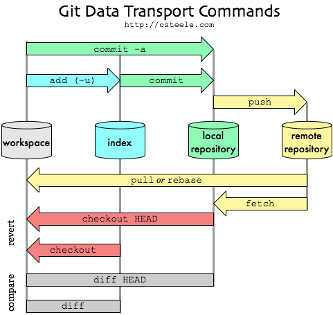
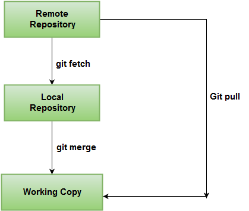

## git data flow



## git fetch vs pull




>The short and easy answer is that ``git pull`` is simply ``git fetch`` followed by ``git merge``.


>It is very important to note that ``git pull`` will **automatically merge whether you like it or not**. This could, of course, result in merge conflicts. Let's say your remote is ``origin`` and your branch is  ``master``. If you ``git diff origin/master`` before pulling, you should have some idea of potential merge conflicts and could prepare your local branch accordingly.

>You can ``fetch`` from a remote repository, **see the differences and then pull or merge**.
>This is an example for a remote repository called ``origin`` and a branch called ``master`` tracking the remote branch origin/master:

``` bash
git checkout master                                                  
git fetch                                        
git diff origin/master
git merge origin/master
```

也可以执行：``git rebase origin master``。
