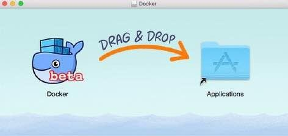
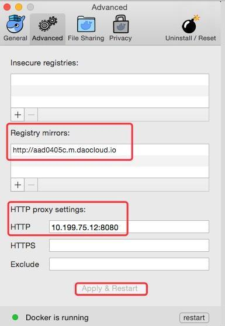

# 手把手体验 Docker HelloWorld

<!-- TOC depthFrom:1 depthTo:6 withLinks:1 updateOnSave:1 orderedList:0 -->

- [手把手体验 Docker HelloWorld](#手把手体验-docker-helloworld)
	- [课程目标](#课程目标)
	- [一、Mac 上安装Docker](#一mac-上安装docker)
	- [二、概念：Docker 引擎，宿主机，镜像（Image），容器（Container）](#二概念docker-引擎宿主机镜像image容器container)
	- [三、在 Docker 上运行 Nginx](#三在-docker-上运行-nginx)
	- [四、容器的管理：查看，进入，stop, start, restart, kill, 删除](#四容器的管理查看进入stop-start-restart-kill-删除)
	- [五、发布自己的一个 Docker Image](#五发布自己的一个-docker-image)
	- [六、总结（简版操作）](#六总结简版操作)

<!-- /TOC -->

## 课程目标

- [x] Mac Pro 上如何安装Docker
- [x] 概念：Docker 引擎，宿主机，镜像（Image），容器（Container）
- [x] 在 Docker 上如何运行 Nginx
- [x] 容器的管理：查看，进入，stop,start, restart,kill,删除
- [x] 怎么发布自己的一个 Docker Image ?

**提醒**
>急速阅读，请直接看第六节“总结（简版操作）”，详细阅读请按序。

---

## 一、Mac 上安装Docker

关于mac下安装docker，搜索下会有一大堆，你只需了解4点：

1. 最早最早Docker不能在mac下运行，只能在Linux运行；
2. 过了不久，得安装 boot2docker 就能在mac下跑docker；
3. 再过了不久，来了个更简单易用的 Docker Toolbox 就能在mac下跑docker；
4. 到了现在，大概是2016年3月（记不清具体时间了），有了 Docker for mac 这种“三点两不点”这样傻瓜式的安装包。



于是你需要做的是：
1. 历史的就让它成为历史，不要碰了。
2. 下载个 Docker for mac ， 尽管它是beta。但是，**官方下载特别慢** ！请去网盘 https://pan.baidu.com/s/1i47ylkp  （无需提取密码，100来兆）
3. 能不能命令行？ brew install docker ?  截止发稿(日期2016.11.02)不能，安装出来的结果跟“docker for mac”的东西不一样多。

**提醒**

>如果你的系统里之前安装过 ``virtualbox`` ，而且版本不够高，``docker for mac`` 会提示你必须 **彻底删除**，或者升级，才能安装 ``docker for mac``.

## 二、概念：Docker 引擎，宿主机，镜像（Image），容器（Container）

 安装好了 ``docker for mac``， 你的mac机器叫宿主机，运行着的那个带界面的``docker for mac`` 叫 Docker 引擎，也有命令行。比如：

 ``` bash
 $ docker images
 ```

就是查看本地已经下载了多少镜像（Image）。什么是镜像（Image）和容器（Container）呢？

docker与``镜像``的关系，可以不严格但便于类比的理解为Linux的yum和软件包（或者Mac的brew和软件包，或者Maven的jar包）。

于是你可以联想到：

``` bash
$ docker images             # 显示本地已下载的镜像，类比 brew list；
$ docker inspect ${image}   # 显示镜像的详细信息，类比 brew info ${some_app}
$ docker search ${image}    # 搜索某个镜像，比如 nginx。 类比 brew search nginx
$ docker pull ${image}      # 下载某个镜像，类比 brew install nginx
$ docker push ${image}      # 上传某个镜像。
```

问题来了，你可能发现，你运行 ``docker images`` 时，啥也没有，因为你没装。你再发现 ``docker search nginx``的时候，半天没结果！！！

因为默认管理这些镜像的仓库（称为 ``Docker Hub`` 或者 ``Docker registry`` 或者 ``Docker repository``）在国外。

**国内镜像站点**

>那么国内有镜像（Mirrors）站点吗？
> 有的，地址： http://aad0405c.m.daocloud.io
> 打开 ``Docker for mac`` -> ``preference`` -> ``advanced`` ，如图添加 ``Registry mirrors`` 。



另外，如果你上外网需要走代理服务器，请设置代理服务器，否则HTTP Proxy不必设置。

设置完后，你执行搜索一下nginx的镜像，会显示很多，排第一的是 daocloud.io 官方制作的。

``` bash
$ docker search nginx
NAME     DESCRIPTION                  STARS   OFFICIAL  AUTOMATED
nginx    Official build of Nginx.     4489      [OK]
jwilder/nginx-proxy       Automated Nginx reverse proxy for docker c...   848        [OK]

……  此处省略很多行
```

接着，下载它，注意在前面添加 daocloud.io 前缀。

``` bash
$ docker pull daocloud.io/nginx
```

下载完成后，查看一下：

``` bash
$ docker images
REPOSITORY           TAG                 IMAGE ID            CREATED             SIZE

daocloud.io/nginx    latest              067c8da9d5ab        11 days ago         181.5 MB
```

截止现在，了解了什么叫Image，但是什么是容器（Container）呢？ 我们运行一下刚才下载的nginx image就知道了。


## 三、在 Docker 上运行 Nginx

运行nginx很简单，只需要 ``docker run daocloud.io/nginx`` 。

当然我们也可以更复杂一点，加点参数，比如：

``` bash
$ docker run --name helloworld -d -p 8080:80 daocloud.io/nginx

4871c4b47f830a73fa8133f125e63d4a5871dac3a887567d5eb54ea7f8d8ac6c
```

接着查看下容器列表：

``` bash
$ docker ps
CONTAINER ID        IMAGE               COMMAND                  CREATED             STATUS              PORTS                           NAMES

4871c4b47f83        daocloud.io/nginx   "nginx -g 'daemon off"   2 minutes ago       Up 2 minutes        443/tcp, 0.0.0.0:8080->80/tcp   hello world
```

命令docker ps 显示的是正在运行的``Container``列表，里面出现了刚才运行的nginx。

>于是可以把“容器（Container）”理解为镜像（Image）的一次运行。这个概念可以类比为“进程”与“程序”的关系。

不信，你再看：

``` bash
$ docker run --name helloworld2 -d -p 9090:80 daocloud.io/nginx

c1d93fbaa49ed16ce7da4cc90cbeba7f1279c15cf849dc5682d84985d3be3c3a

$ docker ps

CONTAINER ID        IMAGE               COMMAND                  CREATED             STATUS              PORTS                           NAMES

c1d93fbaa49e        daocloud.io/nginx   "nginx -g 'daemon off"   19 seconds ago      Up 18 seconds       443/tcp, 0.0.0.0:9090->80/tcp   helloworld2

4871c4b47f83        daocloud.io/nginx   "nginx -g 'daemon off"   7 minutes ago       Up 7 minutes        443/tcp, 0.0.0.0:8080->80/tcp   helloworld
```

出现了第2个``Container``，Command都是nginx -g ，名字一个叫helloworld，另一个叫helloworld2.

如何访问它们呢？

``` bash
$ curl http://localhost:8080
```

会显示 “Welcome to nginx!” 的页面。

``` bash
$ curl http://localhost:9090
```

结果一样，只是访问了另外一个容器罢了。

你或许很着急希望知道：

1. docker run的那些参数是什么意思？
2. 怎么看nginx的日志呢？

以第一个命令：``$ docker run --name helloworld -d -p 8080:80 daocloud.io/nginx`` 来说:
- ``—name`` 是给容器起了一个名字；
- ``-d`` 表示容器运行在后台，如果前台，用``-i``表示交互式；
- ``-p 8080:80`` 表示端口映射，将宿主机的8080端口转发到容器内的80端口；
- ``daocloud.io/nginx`` 表示刚才下载的镜像（Image）。

看日志？ 用命令，``docker logs $container_id``  或者 ``docker logs $container_name``。


``` bash

$ docker ps

CONTAINER ID        IMAGE               COMMAND                  CREATED             STATUS              PORTS                           NAMES

c1d93fbaa49e        daocloud.io/nginx   "nginx -g 'daemon off"   8 minutes ago       Up 8 minutes        443/tcp, 0.0.0.0:9090->80/tcp   helloworld2

4871c4b47f83        daocloud.io/nginx   "nginx -g 'daemon off"   15 minutes ago      Up 15 minutes       443/tcp, 0.0.0.0:8080->80/tcp   helloworld

$ docker logs 4871c4b47f83

172.17.0.1 - - [02/Nov/2016:13:04:16 +0000] "GET / HTTP/1.1" 200 612 "-" "curl/7.37.1" "-"

172.17.0.1 - - [02/Nov/2016:13:05:02 +0000] "GET / HTTP/1.1" 200 612 "-" "curl/7.37.1" "-"

$ docker logs helloworld
172.17.0.1 - - [02/Nov/2016:13:04:16 +0000] "GET / HTTP/1.1" 200 612 "-" "curl/7.37.1" "-"

172.17.0.1 - - [02/Nov/2016:13:05:02 +0000] "GET / HTTP/1.1" 200 612 "-" "curl/7.37.1" “-"

```


## 四、容器的管理：查看，进入，stop, start, restart, kill, 删除

查看宿主机运行着多少个容器，刚才已经用到过 ``docker ps`` 命令。
进入容器内，用 ``docker attach helloworld`` 命令。

``` bash
$ docker attach helloworld
```

发现什么动静都没有？ 如果我们用curl 再访问以下nginx 8080口子，进入容器的状态下会出现一条日志：

``` bash
$ docker attach helloworld

172.17.0.1 - - [02/Nov/2016:13:18:25 +0000] "GET / HTTP/1.1" 200 612 "-" "curl/7.37.1" “-"
```

如果我们要查看容器内运行了哪些进程呢？ 用 ``docker top $container``  命令：

``` bash
$ docker top helloworld
PID                 USER                TIME                COMMAND
1889                root                0:00                nginx: master process nginx -g daemon off;
1905                104                 0:00                nginx: worker process
```

停掉一个容器，可以用stop或kill，区别是stop是优雅关闭，可以做一些收尾工作，kill是强制关闭。

``` bash
$ docker stop helloworld
helloworld

$ docker ps

CONTAINER ID        IMAGE               COMMAND                  CREATED             STATUS              PORTS                           NAMES

c1d93fbaa49e        daocloud.io/nginx   "nginx -g 'daemon off"   20 minutes ago      Up 20 minutes       443/tcp, 0.0.0.0:9090->80/tcp   helloworld2
```

docker ps 显示的是正在运行的容器，如果要显示所有容器（包括停止运行的），需要``docker ps -a`` 参数。

``` bash
$ docker ps -a

CONTAINER ID        IMAGE               COMMAND                  CREATED             STATUS                     PORTS                           NAMES

c1d93fbaa49e        daocloud.io/nginx   "nginx -g 'daemon off"   23 minutes ago      Up 23 minutes              443/tcp, 0.0.0.0:9090->80/tcp   helloworld2

4871c4b47f83        daocloud.io/nginx   "nginx -g 'daemon off"   30 minutes ago      Exited (0) 3 minutes ago                                   hello world

```

如何再次启动helloworld这个容器呢？ 直接 ``docker start helloworld``，并不需要像最开始那样``docker run``了。

``docker restart`` 和  ``docker kill`` 自行试试看。如果我们彻底不要hello world这个容器呢？用``docker rm $container``命令（执行的前提是容器先停止，或者-f强行删除一个正在运行的容器）。

``` bash
$ docker rm helloworld
helloworld

$ docker ps -a

CONTAINER ID        IMAGE               COMMAND                  CREATED             STATUS              PORTS                           NAMES

c1d93fbaa49e        daocloud.io/nginx   "nginx -g 'daemon off"   26 minutes ago      Up 26 minutes       443/tcp, 0.0.0.0:9090->80/tcp   helloworld2
```

名字叫”helloworld”的容器再也不存在了。

## 五、发布自己的一个 Docker Image

时间不早了，下次再说吧~~

剧透下实验内容，下载一个centos的镜像，然后运行起来，进入这个容器，在容器内，就跟我们平时进入的centos操作系统没啥区别。

不过这个简单的centos容器里面，什么工具都没有，比如常用的nc命令呀，curl命令呀，都没有。我们会进入容器，在容器内手动安装nc命令（当然也可以类似Linux的Bash一样弄个脚本，这脚本叫``Dockerfile`` ）。

接着我们会想，我们不希望后来者这么麻烦，需要手动安装nc命令，能做到吗？

可以。我们把安装了nc命令的centos容器，保存为一个镜像，然后起个名字叫centos-with-nc，并发布到docker 仓库，

后来者就可以下载并运行centos-with-nc这个镜像了。他们进入容器时，就能直接用nc命令了。

----

## 六、总结（简版操作）

- [x] Mac Pro 上如何安装Docker
下载docker for mac:      https://pan.baidu.com/s/1i47ylkp

- [x] 概念：Docker 引擎，宿主机，镜像（Image），容器（Container）

``` bash
$ docker run --name helloworld -d -p 8080:80 daocloud.io/nginx
$ docker ps

CONTAINER ID        IMAGE               COMMAND                  CREATED             STATUS              PORTS                           NAMES

4871c4b47f83        daocloud.io/nginx   "nginx -g 'daemon off"   2 minutes ago       Up 2 minutes        443/tcp, 0.0.0.0:8080->80/tcp   hello world
```

mac 机器叫宿主机，docker命令工具集叫docker引擎，docker run 的daocloud.io/nginx 叫镜像，docker ps列表显示的叫容器。

- [x]  在 Docker 上如何运行 Nginx

``` bash
$ docker run --name helloworld -d -p 8080:80 daocloud.io/nginx
```

- [x] 容器的管理：查看，进入，stop, start, restart, kill, 删除

 - 查看：``docker ps``  或 ``docker ps -a``
 - 进入：``docker attach $container``
 - 操作：``docker start/stop/kill/restart/rm  $container`` 等

- [ ] 怎么发布自己的一个 Docker Image ? 下次再说
