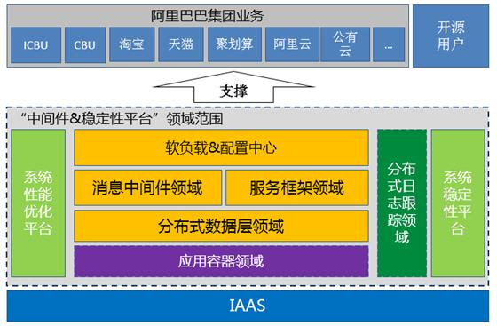

# 阿里中间件团队

http://jm.taobao.org/about/
致力于成为中国第一，世界一流的中间件技术团队

## 阿里中间件团队介绍

阿里中间件团队，是国内为数不多的极具技术挑战性的团队之一，依托于全球规模最大的阿里巴巴电子商务平台所带来的巨大流量和海量数据，以及对于电子商务平台固有的稳定性要求，使得团队有机会去面对一个又一个技术难题，创造一个又一个技术奇迹。在刚刚过去的“2015双十一网购狂欢节”中，912.17亿元销售奇迹背后的每一笔交易订单都和阿里中间件团队的技术小二们息息相关。

中间件团队致力于成为中国第一，世界一流的Java技术团队。自主研发的一系列产品始于07年底开始的淘宝架构2.0到3.0的变迁过程中，使淘宝网 从集中式的Java应用走向了分布式Java应用，涵盖了 **消息中间件、服务框架、数据层、应用服务器和大规模分布式稳定性平台等等** 。解决了淘宝网这个大型系统中的应用间以及应用到水平拆分后的数据库间的访问问题，通过消息中间件对应用进行了解耦并提供了最终一致性支持。目前广泛使用在大淘宝的各个Java应用中以及少部分的非Java应用中。而稳定性平台、性能优化平台是在淘宝系统分布式化后解决和稳定性、容量规划、降级管理、依赖告警以及性能丈量等方面的问题的利器。

中间件团队的同学是一群不安于现状且喜欢折腾的人，未必很资深但是很执着，充满热情。大家来自五湖四海，到这里一起解决技术难题，提升系统性能，完成业务突破，构建新的应用，玩儿转技术、业务、数据、无线。

如果你酷爱技术、喜欢钻研、愿意去帮助多个业务系统的发展，并且认为编程是别人不能剥夺的权利的话，欢迎加入我们，一起提升我们的技术产品，一起去支持业务更好的发展。
如果你希望在淘宝的土壤上，用我们的技术去折腾一些新应用，新玩儿法出来，也欢迎和我们联系。

如果上面的介绍，还没有让你非常了解我们的话，那么最好的方式是加入我们再深入去了解吧。

## 整体情况

## 服务框架-HSF：

HSF旨在为阿里巴巴的应用提供一个分布式的服务框架，HSF从分布式应用层面以及统一的发布/调用方式层面为大家提供支持，从而可以很容易的开发分布式的应用以及提供或使用公用功能模块，而不用考虑分布式领域中的各种细节技术，例如远程通讯、性能损耗、调用的透明化、同步/异步调用方式的实现等等问题。
联系人： 思邪(email:sixie.xyn@alibaba-inc.com）

## 消息中间件-Notify：

notify是一款高性能，高可靠，可无限水平扩展，支持分布式事务，支持复杂消息过滤的与互联网时代紧密结合的消息中间件，是目前公司内部使用最广泛的一个消息中间件产品之一，承担着公司内部90%以上消息服务。他使用推消息的模型，集群可水平扩展，但不保证顺序，也不保证重复的消息中间件产品。
联系人：隆基(longji.lqs@alibaba-inc.com)

## 消息中间件-MetaQ：

MetaQ是一款分布式、队列模型的消息中间件。分为Topic与Queue两种模式，Push和Pull两种方式消费，支持严格的消息顺序，亿级别的堆积能力，支持消息回溯和多个维度的消息查询。
开源介绍：https://github.com/alibaba/rocketmq
联系人：誓嘉(email : shijia.wxr@taobao.com)

## 数据层-TDDL：

TDDL旨为用户提供在线数据库服务。TDDL部分兼容MySQL关系型数据库，并提供数据库在线扩容、性能监测及分析功能。TDDL支持弹性扩容.
开源介绍：https://github.com/alibaba/tb_tddl
联系人：君瑜（email:junyu@taobao.com）

## 数据层-精卫：

精卫填海（简称精卫）是一个基于MySQL数据库的数据复制组件，远期目标是构建一个完善可接入多种不同类型源数据的实时数据复制框架
联系人：魔山(email:huying.hy@alibaba-inc.com)

## 数据层-愚公：

数据自动迁移引擎，海量数据自动运维工具，可用于对用户无影响的自动扩容和缩容，数据平滑迁移，以及异构数据源迁移，目前已经完成了214次业务迁移或扩容。
联系人：君瑜(email:junyu@taobao.com)

## 软负载配置中心-Diamond：

Diamond是一个持久配置管理中间件.可以实现分布式场景下，中心化的持久配置管理，同时也支持基于发布订阅模型配置动态变更推送.
开源介绍：http://code.taobao.org/p/diamond/wiki/index/
联系人: 彦林(water.lyl@alibaba-inc.com)

## 鹰眼 - EagleEye：

EagleEye （鹰眼）通过收集和分析在不同的网络调用中间件上的日志埋点，可以得到同一次请求上的各个系统的调用链关系，有助于梳理应用的请求入口与服务的调用来源、依赖关系，同时，也对分析系统调用瓶颈、估算链路容量、快速定位异常有很大帮助。另外，业务方也可以在调用链上添加自己的业务埋点，使网络调用和实际业务内容得到关联。
联系人：姬风（email:jifeng@taobao.com）

## 实时计算：JStorm

项目简介：JStorm是Storm的Java版本,使用Java重写的同时在其基础上进行了大幅度的改进与优化.与Hadoop对大数据进行离线全量处理相对应，JStorm主要做的是对大数据的实时增量计算与流式计算.
联系人：纪君祥（email：zhongyan.feng@alibaba-inc.com）

## 天枢 VipServer

通过集中式的配置向客户提供路由信息，以非网关的形式实现负载均衡功能；支持多种映射策略（轮询、轮询+同机房、轮询+同网段）；通过健康探测机制，自动剔除不健康的机器，实现集群之间调用的透明化；对调用量、调用方等数据也有一定程度的反馈.
联系人：玄胤（email：xuanyin.zy@alibaba-inc.com）

## 注册中心 ConfigServer

ConfigServer主要提供非持久配置的发布和订阅。07/08年间在淘宝内部开发使用的时候，由于ZooKeeper还没有开源，不然可能会基于ZooKeeper来进行改造。主要使用场景是为分布式服务框架提供软负载功能所必须的服务地址列表。
联系人：慕义（email：en.xuze@alipay.com）

## 服务框架- Pandora：

Pandora，中文名潘多拉，是淘宝网中间件团队打造的，基于HSF隔离技术构建的全新一代隔离容器。从解决二方包依赖冲突出发，致力于统一管理通用的二方包，包括方便的二方包升级管理，监控和管理，建立统一的二方包扩展编程方式等。
联系人：豫楚（email:peng.weip@alibaba-inc.com）

## 性能和稳定性平台-Hotspot：

项目简介：性能分析平台通过对基础软件、服务端、前端加载、网络、CDN等方面的性能分析，来帮助阿里系统提升吞吐量、降低延迟时间、节约成本。
联系人：叔同(email: shutong.dy@taobao.com，新浪微博：淘宝叔同)

## 项目名称：TProfiler：

项目简介：TProfiler是可以在生产环境长期使用的性能分析工具，通过在Java层面记录代码执行热点、对象创建热点等数据，帮助系统定位性能瓶颈。
开源地址：https://github.com/alibaba/TProfiler
联系人新浪微博：叔同(email: shutong.dy@taobao.com，新浪微博：淘宝叔同)
