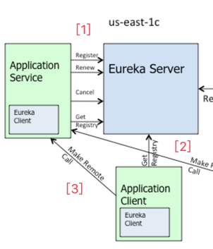
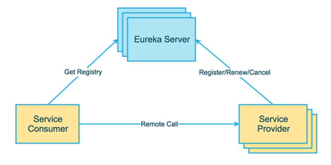
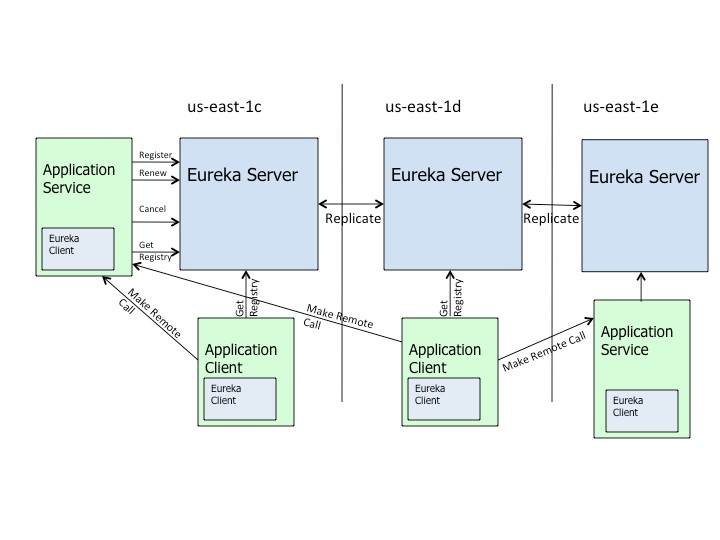

# Discovery Eureka

## 参考资料

- [Eureka-at-a-glance](https://github.com/Netflix/eureka/wiki/Eureka-at-a-glance)
- [Configuring-Eureka](https://github.com/Netflix/eureka/wiki/Configuring-Eureka)
- [从ZooKeeper到Eureka](https://zhidao.baidu.com/question/1885502234226229708.html)

- [深度剖析服务发现组件Netflix Eureka](http://geek.csdn.net/news/detail/130223)

## 快速简介

### What

``Eureka``是什么？
>给``REST``API服务做负载均衡(``LB``)和高可用(``HA``)的中间件。为了做``LB``和``HA``，首先就必须要承担``服务发现``。

类似的东西是什么？

- 运维层的方案：DNS+VIP  （百度目前的方案还是``BNS``）
- 应用层的方案：ZooKeeper+ZooKeeper-Client-Watcher
- 微服务的方案：Netflix Eureka
- API Gateway: 我们的``API Gateway``呢？它到底有哪些功能？

### How

``Eureka``的部署结构？
>跟基于``ZooKeeper``的服务发现的结构是完全类似的。在``ZooKeeper``服务发现体系里面，有3个角色：
> - ``ZooKeeper`` Server: 扮演服务注册中心
> - ``Application Service`` （including ZooKeeper Client）：服务提供者，它会通过ZKClient把自己注册到``ZooKeeper Server``。
> - ``Application Client``（including ZooKeeper Client）：服务消费者，它会通过ZKClient从服务注册中心获取需要的服务。

原文：

- ``Eureka``

>Eureka comes with two components - Eureka Client and the Eureka Server.
> ``Eureka``本身只有2个组件：C端和S端。

- ``Application``

>Your architecture which is using Eureka will typically have two applications
>- ``Application Client`` which uses Eureka Client to make requests to the Application Service.
>- ``Application Service`` which receives requests from Application Client and sends a response back.
>使用``Eureka``做服务发现的应用也只有两个组件：C端和S端。

- ``Service Discovery``(服务发现)

>The setups involve the following
> - Eureka Server
> - Eureka Client for the application client
> - Eureka Client for the application service
> 采用``Eureka``做服务发现，整个体系就有3个组件了：Eureka服务注册中心；携带Eureka客户端的应用S端和携带Eureka客户端的应用C端。

### Arc

有了上面两段的背景，我们看看官方的[架构图](https://github.com/Netflix/eureka/wiki/Eureka-at-a-glance#high-level-architecture)：

- **三者的交互**

>Application Services ``register`` with Eureka and then send ``heartbeats`` to ``renew`` their **leases** every 30 seconds. If the client cannot renew the lease for a few times, it is taken out of the server registry in about 90 seconds. The registration information and the renewals are replicated to all the eureka nodes in the cluster. The clients from any zone can look up the registry information (happens every 30 seconds) to locate their services (which could be in any zone) and make remote calls.

- **跨机房同步**

### 跨平台 ?

``Eureka``是用``Java``写的。那么C，Python怎么办呢？得自己实现客户端功能。那么它的社区繁荣吗？

>For services that are non-Java based, you have a choice of implementing the client part of eureka in the language of the service or you can run a "side car" which is essentially a Java application with an embedded eureka client that handles the registrations and heartbeats. ``REST based endpoints`` are also exposed for all operations that are supported by the Eureka client. Non-Java clients can use the REST end points to query for information about other services.

- 术语

我们常说``RESTful API``，别人说``REST based endpoints``。

### 使用场景

>``Netflix``大量使用Amazon的云机器 ``AWS``。``Eureka``最主要是针对``AWS``的应用场景。
> 亚马逊提供了一个负载均衡工具``Elastic Load Balancer``，但针对的是终端用户Web流量服务器，而Eureka针对的是中间层服务器的负载均衡。
