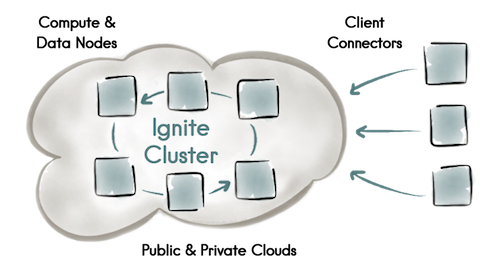

# Ignite 集群化

>Ignite具有非常先进的集群能力，包括逻辑集群组和**自动发现**。

>Ignite的唯一特点是所有节点都是平等的。没有master节点或者server节点，也没有worker节点或者client节点，按照Ignite的观点所有节点都是平等的。




Ignite节点之间会自动发现对方，这有助于必要时扩展集群，而不需要重启整个集群。

开发者可以利用Ignite的混合云支持，允许公有云（比如AWS）和私有云之间建立连接,向他们提供两者的好处。

## 集群API
通过 ``IgniteCluster`` 接口可以：

- 启动和停止一个远程集群节点；
- 获取**集群成员**的列表；
- 创建``逻辑集群组``；


``` java
Ignite ignite = Ignition.ignite();
IgniteCluster cluster = ignite.cluster();

// 在所有集群节点中，获取标记为 worker 的节点，并把它们构成一个``ClusterNode``集群组。
ClusterGroup workers =  cluster.forAttribute("ROLE", "worker");
Collection<ClusterNode> nodes = workers.nodes();

// 本地节点
// Local Ignite node.
ClusterNode localNode = cluster.localNode();

// Node metrics.
ClusterMetrics metrics = localNode.metrics();

// Get some metric values.
double cpuLoad = metrics.getCurrentCpuLoad();
long usedHeap = metrics.getHeapMemoryUsed();
int numberOfCores = metrics.getTotalCpus();
int activeJobs = metrics.getCurrentActiveJobs();

```

### 集群组

从设计上讲，**所有集群节点都是平等的**，所以没有必要以一个特定的顺序启动任何节点，或者给他们赋予特定的规则。

然而，Ignite可以因为一些应用的特殊需求而创建集群节点的**逻辑组**，比如，可能希望只在远程节点上部署一个服务，或者给部分worker节点赋予一个叫做‘worker’的规则来做作业的执行。


>可以限制作业执行、服务部署、消息、事件以及其他任务**只在部分集群组内执行**，比如，下面这个例子只把作业广播到远程节点（除了本地节点）：

``` java
final Ignite ignite = Ignition.ignite();
IgniteCluster cluster = ignite.cluster();
// Get compute instance which will only execute
// over remote nodes, i.e. not this node.
IgniteCompute compute = ignite.compute(cluster.forRemotes());
// Broadcast to all remote nodes and print the ID of the node
// on which this closure is executing.
compute.broadcast(() -> System.out.println("Hello Node: " + ignite.cluster().localNode().id());
```

### Clients/Servers

``` java
IgniteCluster cluster = ignite.cluster();

// All client nodes.
ClusterGroup clientGroup = cluster.forClients();

// All server nodes.
ClusterGroup serverGroup = cluster.forServers();
```


### 节点属性

>Ignite的唯一特点是所有节点都是平等的。没有master节点或者server节点，也没有worker节点或者client节点，按照Ignite的观点所有节点都是平等的。

>但是，可以将节点配置成master，worker，或者client以及data节点。 所有集群节点启动时都会自动将所有的环境和系统属性注册为节点的属性，但是也可以通过配置自定义节点属性。

- 设置节点属性(XML版)

``` xml
<bean class="org.apache.ignite.IgniteConfiguration">
    ...
    <property name="userAttributes">
        <map>
            <entry key="ROLE" value="worker"/>
        </map>
    </property>
    ...
</bean>
```

- 设置节点属性（Java版）

``` java
IgniteConfiguration cfg = new IgniteConfiguration();

Map<String, String> attrs = Collections.singletonMap("ROLE", "worker");

cfg.setUserAttributes(attrs);

// Start Ignite node.
Ignite ignite = Ignition.start(cfg);
```


>启动时，所有的环境变量和系统属性都会自动地注册为节点属性。
节点属性是通过ClusterNode.attribute("propertyName")属性获得的。


### 自定义集群组：谓词逻辑


一个集群组只会包括 **CPU利用率小于50%** 的节点，注意这个组里面的节点会随着CPU负载的变化而改变。

``` java
IgniteCluster cluster = ignite.cluster();

// Nodes with less than 50% CPU load.
ClusterGroup readyNodes = cluster.forPredicate((node) -> node.metrics().getCurrentCpuLoad() < 0.5);

```
