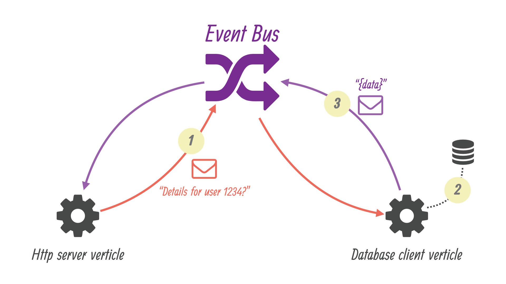

http://vertx.io/docs/guide-for-java-devs/


## 目的

帮助``J2EE``和``Spring``的Java程序员，转型做``异步``开发（类似``nodejs``程序员）。

## 样例

- 一个``wiki``应用
- 存储用关系型数据库
- 页面用``templates``技术（而不是前端``javascript``）
- 使用``verticle``进行隔离
- 包含单元测试代码
- 提供 RESTful API
- 安全与权限控制
- 基于``RxJava``做代码重构
- 前端用``AngularJS``
- 实时性用基于``SockJS``的``eventbus``

现代教程的特点：提供 **github** 地址，不仅包含代码，还包含教程，更包括互动反馈。

>The source of both this **document and the code examples** are available from https://github.com/vert-x3/vertx-guide-for-java-devs. We welcome issue reports, feedback and pull-requests!


## 简介

### 异步

>Vert.x is not a framework but a toolkit: the core library **defines the fundamental APIs for writing asynchronous networked applications**, and then you can pick the useful modules for your application (e.g., database connection, monitoring, authentication, logging, service discovery, clustering support, etc). Vert.x is based on the Netty project, a high-performance asynchronous networking library for the JVM.
> Vert.x will let you access the Netty internals if need be, but in general you will better benefit from the higher-level APIs that Vert.x provides while not sacrificing performance compared to raw Netty.

``vert.x``重点就是突出：异步。异步都是IO密集型的应用才能发挥优势。``vert.x``的异步底层是依赖``Netty``，但是``vert.x``让人用起来更加方便。当然``vert.x``允许你直接访问``Netty``的API。

### 为什么异步？

>Vert.x was designed for asynchronous communications it can deal with **more concurrent network connections with less threads** than synchronous APIs such as Java servlets or java.net socket classes.

异步的优势：用更少的线程支撑更多的并发连接。使用``vert.x``的时候，你要抛弃``servlets``的概念，因为两者就不是一个体系。


>Vert.x is useful for a large range of applications: high volume message / event processing, micro-services, API gateways, HTTP APIs for mobile applications, etc. Vert.x and its ecosystem provide all sorts of technical tools for building **end-to-end reactive applications**.

``vert.x``的应用场景：

- 消息系统：因为消息系统通常都是IO密集型的，几乎没有计算。
- 微服务：现代架构理念，伴随着``Docker``一起到来。
- ``api gateway``：类似``nginx``的反向代理。


### 多语言

>Finally, it is worth mentioning that Vert.x is polyglot as it supports a wide range of popular JVM languages: Java, Groovy, Scala, Kotlin, JavaScript, Ruby and Ceylon.

``Vert.x``支持多语言，但是这些语言都必须是``JVM``语言。特别提醒的是现在的``JavaScript``也是可以跑在``JVM``上的。


### 核心概念

>There are **2 key concepts** to learn in Vert.x:
>- what a **verticle** is, and
>- how the **event bus** allows verticles to communicate.

#### 多线程模型

>Threading and programming models
> Many networking libraries and frameworks rely on a simple threading strategy: each network client is being assigned a thread upon connection, and this thread deals with the client until it disconnects.

服务器与客户端是1:m的关系，传统借助多线程模型：一个连接上来，需要分配一个线程，然后进行IO操作，直到关闭IO，线程才会释放。

>While this "synchronous I/O" threading model has the advantage of remaining simple to comprehend, it hurts scalability with too many concurrent connections as system **threads are not cheap**, and under heavy loads an operating system **kernel spends significant time just on thread scheduling** management.

多线程模型有个优点就是“使用方便（编程容易）”。但是它的劣势是伸缩性差，当并发连接数多的时候，就必须线程多，线程多的时候，会导致操作系统的线程调度非常消耗时间。

#### event-loop

>The unit of deployment in Vert.x is called a ``Verticle``.
> A ``verticle`` processes incoming events over an ``event-loop``,
> where events can be anything like receiving network buffers, timing events, or messages sent by other verticles.

有哪些事件呢？

- 网路事件：网络IO（``network buffers``）
- 定时事件：定时器 （``timing events``）
- 消息：其他``verticle``发来的消息。如果两个``verticle``都在一个JVM里面，那么这个事件并没有走网络。

**Don't Block me**

>Each event shall be processed in a reasonable amount of time to not block the event loop.
>This means that thread **blocking operations shall not be performed while executed on the event loop**, exactly like processing events in a graphical user interface (e.g., freezing a Java / Swing interface by doing a slow network request).


>As we will see later in this guide, Vert.x offers mechanisms to **deal with blocking operations outside of the event loop**. In any case Vert.x emits warnings in logs when the event loop has been processing an event for too long, which is also configurable to match application-specific requirements (e.g., when working on slower **IoT ARM boards**).

>IoT 领域的芯片都是``ARM``的？

遵守个原则：

- 千万不能阻塞``event-loop``
- 程序员很可能会阻塞，所以``vert.x``提供了自动检测机制
- 如果业务原因，就是有一个阻塞操作，怎么办？必须在``event-loop``外部处理

**有多少个``event-loop``呢？**

> Every event loop is attached to a thread.
> By default Vert.x attaches 2 event loops per CPU core thread.
> The direct consequence is that **a regular verticle always processes events on the same thread**, so there is no need to use thread coordination mechanisms to manipulate a verticle state (e.g, Java class fields).

注意：

- ``event-loop``并非只有一个，而是多个。一个CPU核，2个``event-loop``线程。
- 什么是``event-loop``，其实就是执行``selector.select()``方法的线程。
- ``selector.select()``接到事件后，并不需要丢给线程池，而是就在当前线程执行。

#### event-bus

>Verticles form technical units of deployments of code in Vert.x. The Vert.x event bus is the main tool for different verticles to communicate through asynchronous message passing.

>For instance suppose that we have a verticle for dealing with HTTP requests, and a verticle for managing access to the database. The event bus allows the HTTP verticle to send a request to the database verticle that performs a SQL query, and responds back to the HTTP verticle

两个``verticle``：

- 一个执行HTTP Server
- 另一个执行SQL访问
- 它们之间依靠``event-bus``来异步



系统间通信格式，除了二进制外，就是JSON，因为太通用了。几乎类比现实世界的英语。


## wiki应用


# 问题

- [ ] 线程切换的时间消耗如何查看？ [工具](http://blog.tsunanet.net/2010/11/how-long-does-it-take-to-make-context.html)

# Tips

## Maven 项目模板

平时用``maven``搭建个java项目，项目结构挺费劲，有人专门做了个模板项目：[a template project structure ](https://github.com/vert-x3/vertx-maven-starter)

``` bash
git clone https://github.com/vert-x3/vertx-maven-starter.git vertx-wiki
cd vertx-wiki
rm -rf .git
git init
```

## 嵌入式数据库 HSQLDB

[HSQLDB](http://hsqldb.org/)

HSQLDB is Java developers' best choice for development, testing and deployment of database applications.

## Callback Hell

>Vert.x is a largely un-opinionated project, and callbacks allow the implementation of different models that better cope with asynchronous programming: reactive extensions (via RxJava), promises and futures, fibers (using bytecode instrumentation), etc.

异步编程的麻烦问题的确有``callback hell``。但是，它并不强制你使用``callback``，你可以选择：reactive extensions (via RxJava), promises and futures, fibers (using bytecode instrumentation)。它们可以做到“以同步的编程方式，实现异步的通信”（这就是``协程``）。


>Since all Vert.x APIs are ``callback-oriented`` before other abstractions like RxJava can be leveraged, this guide only uses callbacks in the first sections to ensure that the reader gets familiar with the core concepts in Vert.x. It is also arguably easier to start with callbacks to draw a line between the many sections of asynchronous code.

>Once it becomes evident in the sample code that callbacks do not always lead to easily readable code, we will introduce the ``RxJava`` support to show how the same asynchronous code can be better expressed by thinking in streams of processed events.
